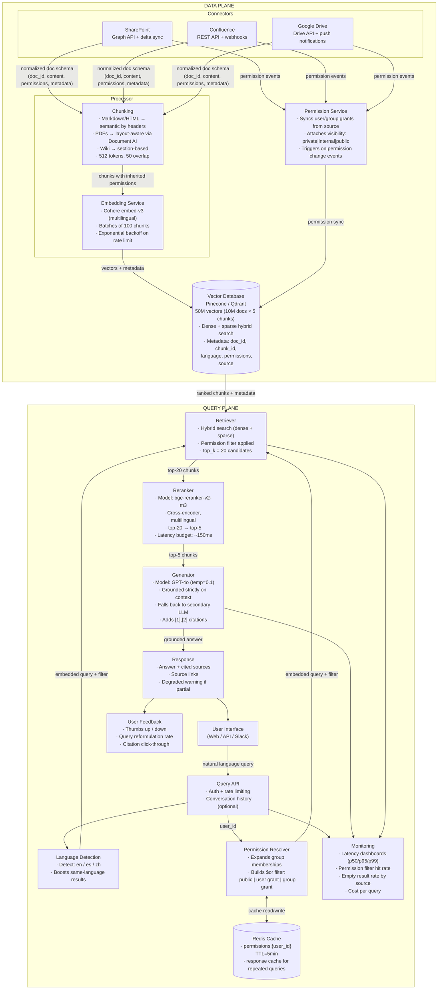
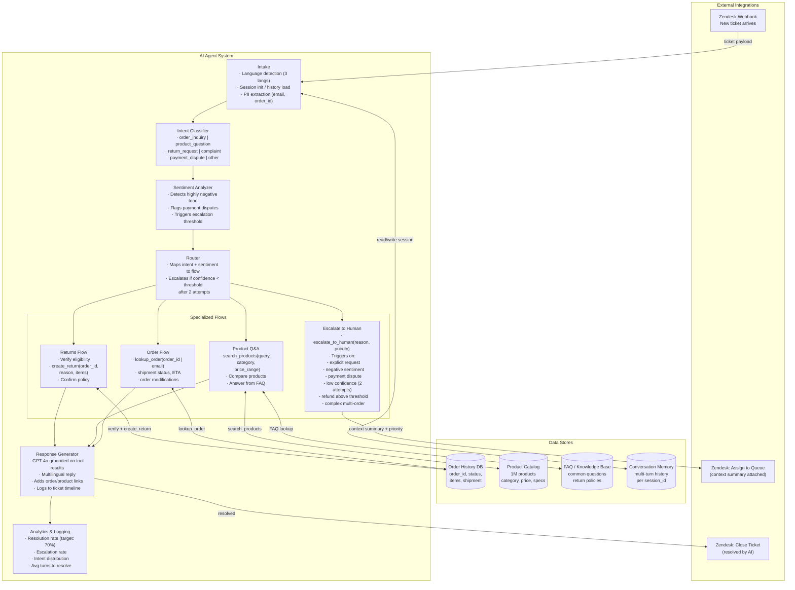
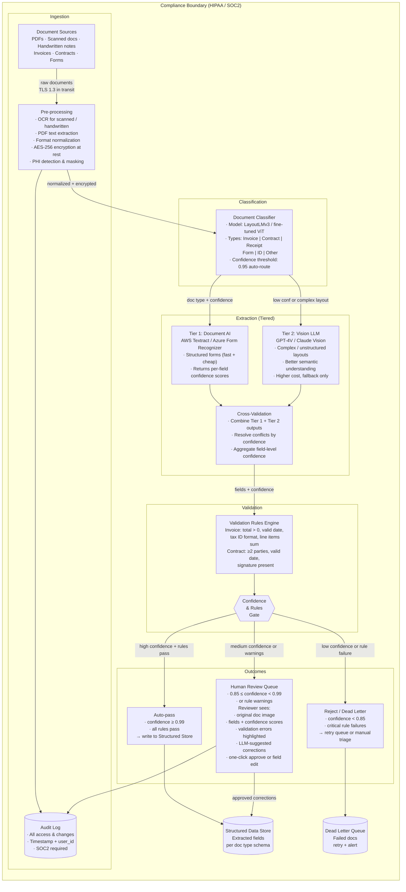
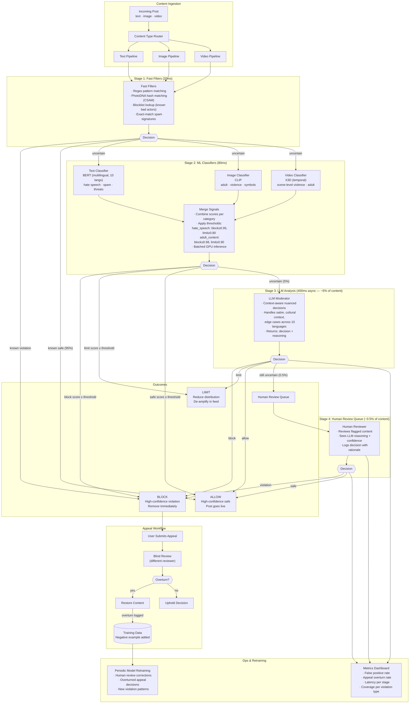
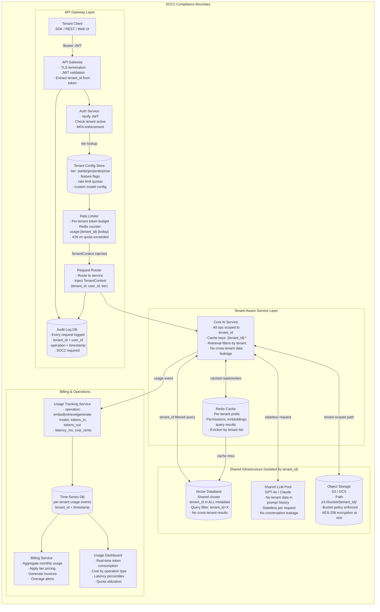
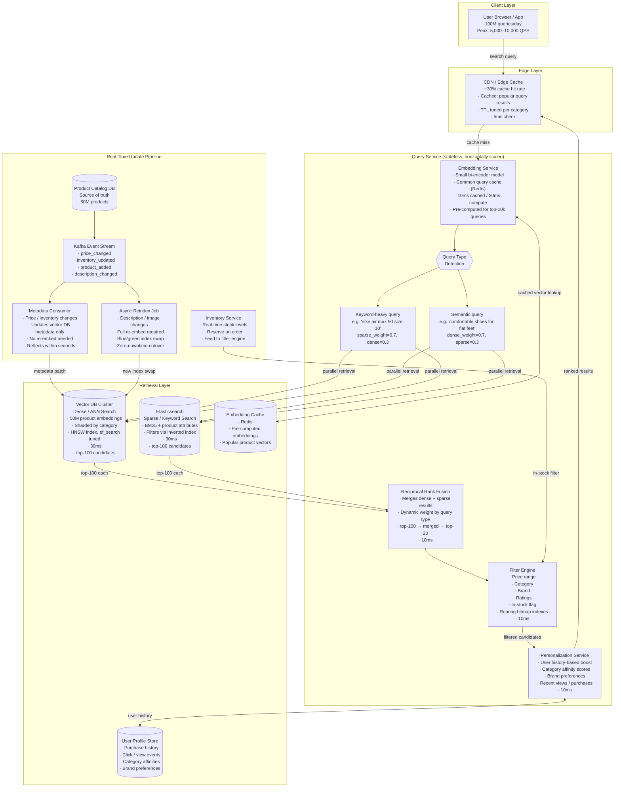

# Whiteboard Exercises for AI System Design

This chapter provides detailed walkthroughs of system design exercises commonly asked in AI-focused interviews. Each exercise includes the full problem statement, a structured solution approach, and discussion points that distinguish strong candidates.

## Table of Contents

- [Exercise 1: Enterprise RAG System](#exercise-1-enterprise-rag-system)
- [Exercise 2: Customer Support Chatbot](#exercise-2-customer-support-chatbot)
- [Exercise 3: Code Review Assistant](#exercise-3-code-review-assistant)
- [Exercise 4: Document Processing Pipeline](#exercise-4-document-processing-pipeline)
- [Exercise 5: Real-Time Content Moderation](#exercise-5-real-time-content-moderation)
- [Exercise 6: Multi-Tenant AI Platform](#exercise-6-multi-tenant-ai-platform)
- [Exercise 7: Semantic Search at Scale](#exercise-7-semantic-search-at-scale)
- [Tips for Whiteboard Exercises](#tips-for-whiteboard-exercises)

---

## Exercise 1: Enterprise RAG System

### Problem Statement

Design a RAG-based knowledge assistant for a large enterprise with the following requirements:

- 10 million documents from multiple sources (SharePoint, Confluence, Google Drive, internal wikis)
- 50,000 employees with role-based access
- Documents update continuously
- Must respect document permissions at query time
- Sub-3 second response time for 95% of queries
- Support for multiple languages (English, Spanish, Mandarin)

### Time Allocation (35 minutes)

| Phase | Time | Focus |
|-------|------|-------|
| Clarification | 3 min | Scope, priorities, constraints |
| High-level architecture | 7 min | Components and data flow |
| Data pipeline | 8 min | Ingestion, chunking, indexing |
| Query pipeline | 8 min | Retrieval, generation, permissions |
| Reliability and scale | 5 min | Failure handling, scaling |
| Evaluation | 4 min | Metrics and monitoring |

### Solution Walkthrough

#### Clarification Questions

```
1. What is the document size distribution? (PDFs, wikis, code?)
2. How often do permissions change? (Impacts caching strategy)
3. Is conversation history required or single-turn Q&A?
4. What is the accuracy bar? (Can we say "I don't know"?)
5. Are there compliance requirements? (Audit, data residency)
```

#### High-Level Architecture



#### Data Pipeline Deep Dive

**1. Connectors:**
```
Each source has a dedicated connector:
- SharePoint: Graph API with delta sync
- Confluence: REST API with webhooks
- Google Drive: Drive API with push notifications

Connector responsibilities:
- Fetch document content and metadata
- Track change events (create, update, delete)
- Extract permissions from source system
- Normalize to common document schema
```

**2. Document Schema:**
```json
{
  "doc_id": "uuid",
  "source": "sharepoint|confluence|gdrive",
  "source_id": "original_id_in_source",
  "title": "string",
  "content": "string",
  "content_type": "pdf|html|docx|md",
  "language": "en|es|zh",
  "permissions": {
    "users": ["user_id_1", "user_id_2"],
    "groups": ["group_id_1"],
    "visibility": "private|internal|public"
  },
  "metadata": {
    "author": "string",
    "created_at": "timestamp",
    "updated_at": "timestamp",
    "path": "folder/path"
  }
}
```

**3. Chunking Strategy:**
```
Given mixed document types, use adaptive chunking:

- Markdown/HTML: Semantic chunking by headers
- PDFs: Layout-aware chunking using document AI
- Wiki pages: Section-based chunking

Chunk parameters:
- Target size: 512 tokens
- Overlap: 50 tokens
- Preserve: headers, tables, code blocks

Each chunk inherits parent document permissions.
```

**4. Embedding:**
```
Multilingual requirement suggests:
- Model: Cohere embed-v3 (multilingual, good quality)
- Alternative: OpenAI text-embedding-3-large

Batch embedding:
- Process in batches of 100 chunks
- Rate limit handling with exponential backoff
- Store embedding with chunk in vector DB
```

**5. Vector Database Choice:**
```
Pinecone or Qdrant for this scale.

Selection criteria:
- Metadata filtering: Critical for permissions
- Scale: 10M docs × 5 chunks = 50M vectors
- Hybrid search: Needed for keyword queries

Schema:
- Vector: embedding
- Metadata: doc_id, chunk_id, language, permissions, source
```

#### Query Pipeline Deep Dive

**1. Permission Resolution:**
```python
def get_user_permissions(user_id: str) -> PermissionSet:
    """
    Resolve all documents user can access.
    Returns set of:
    - Direct user grants
    - Group memberships expanded
    - Public document access
    
    CACHED with 5-minute TTL since permissions change infrequently.
    """
    cache_key = f"permissions:{user_id}"
    if cached := cache.get(cache_key):
        return cached
    
    perms = permission_service.resolve(user_id)
    cache.set(cache_key, perms, ttl=300)
    return perms
```

**2. Retrieval with Filtering:**
```python
def retrieve(query: str, user_id: str, top_k: int = 20) -> List[Chunk]:
    perms = get_user_permissions(user_id)
    
    # Detect language for query
    lang = detect_language(query)
    
    # Build permission filter
    # User can see: public docs, their own, or groups they belong to
    filter = {
        "$or": [
            {"visibility": "public"},
            {"users": {"$in": [user_id]}},
            {"groups": {"$in": perms.groups}}
        ]
    }
    
    # Optional: boost same-language content
    if lang != "en":
        filter["language"] = lang
    
    results = vector_db.search(
        query_embedding=embed(query),
        top_k=top_k,
        filter=filter
    )
    return results
```

**3. Reranking:**
```
Rerank top-20 to get top-5 with cross-encoder.
Model: bge-reranker-v2-m3 (multilingual)
Latency budget: ~100ms
```

**4. Generation:**
```python
def generate(query: str, chunks: List[Chunk], user_id: str) -> Response:
    context = format_chunks_with_citations(chunks)
    
    prompt = f"""You are a knowledge assistant for [Company].
Answer the question using ONLY the provided context.
If the context does not contain the answer, say "I could not find information about that in our knowledge base."
Always cite sources using [1], [2] format.

CONTEXT:
{context}

QUESTION: {query}
"""
    
    response = llm.generate(
        prompt=prompt,
        model="gpt-4o",
        temperature=0.1
    )
    
    return format_with_source_links(response, chunks)
```

#### Scaling and Reliability

**Latency Budget (p95 < 3s):**
```
Permission resolution:   50ms  (cached)
Embedding:              100ms
Vector search:          100ms
Reranking:              150ms
LLM generation:        1500ms
Network/overhead:       100ms
─────────────────────────────
Total:                 2000ms (buffer for P95)
```

**Scaling Considerations:**
```
- Vector DB: Sharded by source or hash
- Embedding service: Horizontal scale, stateless
- LLM calls: Multiple providers for redundancy
- Cache: Redis cluster for permissions and responses
```

**Failure Handling:**
```
- Vector DB down: Return cached results + degraded warning
- LLM down: Fallback to secondary provider
- Rate limiting: Queue with backpressure
- Embedding service: Batch retries with circuit breaker
```

#### Evaluation Approach

**Offline Metrics:**
```
- Retrieval: Precision@5, Recall@5, MRR
- Generation: RAGAS (faithfulness, relevance)
- End-to-end: Answer correctness on test set
```

**Online Metrics:**
```
- User feedback: Thumbs up/down
- Query reformulation rate: User rephrasing indicates failure
- Citation click-through: Are sources useful?
```

**Monitoring:**
```
- Latency dashboards by percentile
- Permission filter hit rate
- Empty result rate by source
- Cost per query
```

---

## Exercise 2: Customer Support Chatbot

### Problem Statement

Design an AI-powered customer support system for an e-commerce company:

- Handle 10,000 conversations per day
- Access to product catalog (1M products), order history, FAQs
- Goal: Resolve 70% of tickets without human handoff
- Support order lookup, returns, product questions
- Multilingual support (3 languages)
- Integration with existing Zendesk ticketing

### Solution Highlights

**Key Architectural Decisions:**

1. **Agent Architecture with Flow Control:**


2. **Tool Design:**
```python
tools = [
    {
        "name": "lookup_order",
        "description": "Look up order details by order ID or customer email",
        "parameters": {
            "order_id": "optional string",
            "email": "optional string"
        }
    },
    {
        "name": "search_products",
        "description": "Search product catalog",
        "parameters": {
            "query": "string",
            "category": "optional string",
            "price_range": "optional tuple"
        }
    },
    {
        "name": "create_return",
        "description": "Initiate a return for an order",
        "parameters": {
            "order_id": "string",
            "reason": "string",
            "items": "list of item IDs"
        }
    },
    {
        "name": "escalate_to_human",
        "description": "Transfer to human agent",
        "parameters": {
            "reason": "string",
            "priority": "low|medium|high"
        }
    }
]
```

3. **Escalation Criteria:**
```
Escalate to human when:
- Customer explicitly requests human
- Sentiment is highly negative (detected by classifier)
- Issue involves payment disputes
- Agent confidence is low after 2 attempts
- Complex multi-order issues
- Refund above threshold amount
```

4. **Integration Pattern:**
```
Zendesk integration:
- Webhook receives new tickets
- AI handles via API
- Resolution → close ticket
- Escalation → assign to queue with context summary
- All interactions logged to ticket timeline
```

---

## Exercise 3: Code Review Assistant

### Problem Statement

Design a code review assistant for a development platform:

- Reviews pull requests automatically
- Provides specific, actionable feedback
- Respects repository style guides and conventions
- Can suggest code fixes
- Integration with GitHub/GitLab
- Handles 50,000 PRs per day

### Solution Highlights

**Key Technical Choices:**

1. **Context Assembly:**
```
For each changed file, assemble context:
- The diff (changed lines)
- Full file content (for understanding)
- Related files (imports, tests, types)
- Repository conventions (.eslintrc, .editorconfig)
- Previous review comments (learn from feedback)
```

2. **Review Categories:**
```python
review_types = [
    "bug_risk",           # Potential bugs
    "security",           # Security issues
    "performance",        # Performance concerns
    "maintainability",    # Code quality
    "style",              # Style guide violations
    "test_coverage"       # Missing tests
]
```

3. **Model Selection:**
```
Primary: Claude 3.5 Sonnet (best for code understanding)
Fallback: GPT-4o

Specialized models:
- Security scanning: CodeQL + LLM review
- Style: Linters + LLM explanation
```

4. **Output Format:**
```markdown
## Review Summary

### Critical Issues (must fix)
- **Line 45**: SQL injection vulnerability in user query
  ```python
  # Instead of:
  query = f"SELECT * FROM users WHERE id = {user_id}"
  # Use:
  query = "SELECT * FROM users WHERE id = ?"
  cursor.execute(query, (user_id,))
  ```

### Suggestions (consider fixing)
- **Line 78-82**: This loop could be simplified using list comprehension
...
```

5. **Latency Strategy:**
```
Target: Review ready within 2 minutes of PR creation

Strategy:
- Queue PR for processing
- Parallel processing of files
- Stream results as available
- Cache repository conventions
```

---

## Exercise 4: Document Processing Pipeline

### Problem Statement

Design a document processing pipeline for financial services:

- Process 100,000 documents per day (invoices, contracts, forms)
- Extract structured data with 99% accuracy
- Handle PDFs, scanned documents, handwritten notes
- HIPAA/SOC2 compliance
- Human review for low-confidence extractions

### Solution Highlights

**Pipeline Architecture:**



**Key Components:**

1. **Document Classification:**
```
Fine-tuned classifier on document types:
- Invoice, Contract, Receipt, Form, ID, Other

Model: LayoutLMv3 or fine-tuned ViT
Confidence threshold: 0.95 for auto-routing
```

2. **Extraction Strategy:**
```
Tiered extraction based on document type:

Tier 1: Document AI (Textract/Azure)
- Good for structured forms
- Fast and cheap
- Returns confidence scores

Tier 2: Vision LLM (GPT-4V/Claude)
- Fallback for complex layouts
- Better for unstructured text
- More expensive

Combine outputs and cross-validate.
```

3. **Validation Rules:**
```python
validation_rules = {
    "invoice": [
        ("total", lambda x: x > 0, "Total must be positive"),
        ("date", lambda x: parse_date(x), "Invalid date format"),
        ("vendor_id", lambda x: regex_match(x, TAX_ID_PATTERN), "Invalid tax ID"),
        ("line_items", lambda x: sum(i.amount for i in x) == total, "Line items must sum to total")
    ],
    "contract": [
        ("parties", lambda x: len(x) >= 2, "Contract must have at least 2 parties"),
        ("effective_date", lambda x: parse_date(x), "Invalid date"),
        ("signature_present", lambda x: x == True, "Signature required")
    ]
}
```

4. **Human Review Interface:**
```
Reviewer sees:
- Original document image
- Extracted fields with confidence scores
- Validation errors highlighted
- Suggested corrections from LLM
- One-click approval or field-level corrections
```

5. **Compliance Measures:**
```
HIPAA/SOC2 requirements:
- All documents encrypted at rest (AES-256)
- TLS 1.3 in transit
- Audit log for all access and changes
- PHI detection and masking
- Retention policies enforced
- Access controls with MFA
```

---

## Exercise 5: Real-Time Content Moderation

### Problem Statement

Design a content moderation system for a social platform:

- 1 million posts per day (text, images, video)
- Latency requirement: under 500ms for posts to be visible
- Detect: hate speech, violence, adult content, spam
- Appeal workflow for false positives
- Support 10 languages

### Solution Highlights

**Architecture Pattern: Multi-Stage Cascade**



**Key Design Decisions:**

1. **Latency Optimization:**
```
Target: 500ms total

Stage 1 (Fast): 20ms
- Regex patterns
- Known hash matching (PhotoDNA)
- Blocklist lookup

Stage 2 (ML): 80ms
- Batched inference on GPU
- Small specialized models
- Parallel text/image processing

Stage 3 (LLM): 400ms (async for borderline)
- Only 5% of content reaches here
- Used for nuanced decisions
```

2. **Threshold Strategy:**
```python
class ModerationDecision:
    BLOCK = "block"          # High confidence violation
    ALLOW = "allow"          # High confidence safe
    LIMIT = "limit"          # Reduce distribution
    REVIEW = "human_review"  # Queue for human

thresholds = {
    "hate_speech": {
        "block": 0.95,
        "limit": 0.80,
        "review": 0.60
    },
    "adult_content": {
        "block": 0.98,  # Higher threshold, legal implications
        "limit": 0.90,
        "review": 0.70
    }
}
```

3. **Appeal Workflow:**
```
1. User submits appeal
2. Content queued for human review
3. Different reviewer than original (blind review)
4. Decision logged with reasoning
5. If overturned:
   - Content restored
   - Original decision added to training data as negative
   - Model retrained periodically
```

---

## Exercise 6: Multi-Tenant AI Platform

### Problem Statement

Design a multi-tenant AI platform (AI-as-a-Service):

- Serve 500+ enterprise customers
- Each customer has their own documents and models
- Complete data isolation between tenants
- Per-tenant usage tracking and billing
- Different pricing tiers with different capabilities
- SOC2 compliance required

### Solution Highlights

**Tenant Isolation Architecture:**



**Critical Isolation Points:**

```python
class TenantContext:
    tenant_id: str
    user_id: str
    tier: str  # "starter" | "pro" | "enterprise"
    
    def __enter__(self):
        # Set tenant context for all downstream calls
        _tenant_context.set(self)
        
    def __exit__(self, *args):
        _tenant_context.set(None)

# Middleware ensures tenant context on every request
@middleware
def enforce_tenant_context(request, call_next):
    tenant_id = extract_tenant_from_token(request.headers["Authorization"])
    with TenantContext(tenant_id=tenant_id, ...):
        verify_tenant_access(tenant_id, request.path)
        response = call_next(request)
        add_tenant_to_audit_log(tenant_id, request, response)
    return response
```

**Billing and Usage Tracking:**

```python
usage_schema = {
    "tenant_id": "string",
    "timestamp": "datetime",
    "operation": "embed|retrieve|generate",
    "model": "string",
    "tokens_in": "int",
    "tokens_out": "int",
    "latency_ms": "int",
    "cost_cents": "decimal"
}

# Real-time usage aggregation
async def track_usage(tenant_id: str, operation: Usage):
    # Append to time-series DB
    await timeseries.write("usage", {
        "tenant_id": tenant_id,
        **operation.dict()
    })
    
    # Update real-time counter for rate limiting
    await redis.incr(f"usage:{tenant_id}:{today()}", operation.tokens)
```

---

## Exercise 7: Semantic Search at Scale

### Problem Statement

Design a semantic search system for an e-commerce site:

- 50 million products
- 100 million queries per day
- P99 latency under 100ms
- Support filters (price, category, brand, ratings)
- Personalization based on user history
- Real-time inventory updates

### Solution Highlights

**Key Challenge: 100ms at 100M queries/day**

```
100M queries/day = 1,157 QPS average
Peak: 5,000-10,000 QPS

At 100ms latency, need:
- Edge caching
- Pre-computed embeddings
- Optimized retrieval
- Minimal LLM involvement
```

**Architecture:**



**Latency Budget:**

```
Edge cache check:    5ms
Embedding lookup:   10ms (cached) or 30ms (compute)
Vector search:      30ms
Filtering:          10ms
Personalization:    10ms
Serialization:      10ms
Network overhead:   25ms
─────────────────────
Total:              100ms target (with cache hit)
```

**Hybrid Search Strategy:**

```python
def search(query: str, filters: dict, user_id: str) -> List[Product]:
    # Determine search strategy based on query
    if is_keyword_heavy(query):
        # "nike air max 90 size 10"
        sparse_weight = 0.7
        dense_weight = 0.3
    else:
        # "comfortable running shoes for flat feet"
        sparse_weight = 0.3
        dense_weight = 0.7
    
    # Parallel retrieval
    dense_results = vector_db.search(embed(query), top_k=100, filter=filters)
    sparse_results = elastic.search(query, top_k=100, filter=filters)
    
    # Reciprocal rank fusion
    combined = rrf_merge(
        [dense_results, sparse_results],
        weights=[dense_weight, sparse_weight]
    )
    
    # Personalization boost
    personalized = apply_user_preferences(combined, user_id)
    
    return personalized[:20]
```

**Real-Time Updates:**

```
Product updates (price, inventory) flow:
1. Change event published to Kafka
2. Consumer updates vector DB metadata
3. Search reflects change within seconds

Reindexing (description changes):
1. Full re-embed required
2. Run as async job
3. Swap index when complete
```

---

## Tips for Whiteboard Exercises

### Drawing Tips

1. **Start with boxes and labels** before connecting with arrows
2. **Use consistent notation**: rectangles for services, cylinders for databases, arrows for data flow
3. **Label data on arrows**: what flows between components
4. **Leave space** for additions as you discuss

### Common Patterns to Know

| Pattern | When to Use | Draw As |
|---------|-------------|---------|
| Load balancer + service fleet | Any scaled service | LB → multiple boxes |
| Queue + workers | Async processing | Queue → worker pool |
| Cache layer | Read-heavy, latency-sensitive | Diamond before service |
| CDC/streaming | Real-time updates | Kafka/stream icon |
| Sidecar | Cross-cutting concerns | Small box attached to service |

### Phrases That Signal Strong Candidates

- "Before I design this, let me understand the scale..."
- "The tradeoff here is..."
- "In production, we would also need..."
- "One failure mode to consider is..."
- "Let me walk you through the latency budget..."
- "For evaluation, I would measure..."

### Time Management

- Do not spend more than 5 minutes on clarification
- Draw the complete high-level picture before deep diving
- Leave time for reliability and evaluation
- Check in with the interviewer on focus areas

---

*See also: [Question Bank](01-question-bank.md) | [Answer Frameworks](02-answer-frameworks.md) | [Common Pitfalls](03-common-pitfalls.md)*
