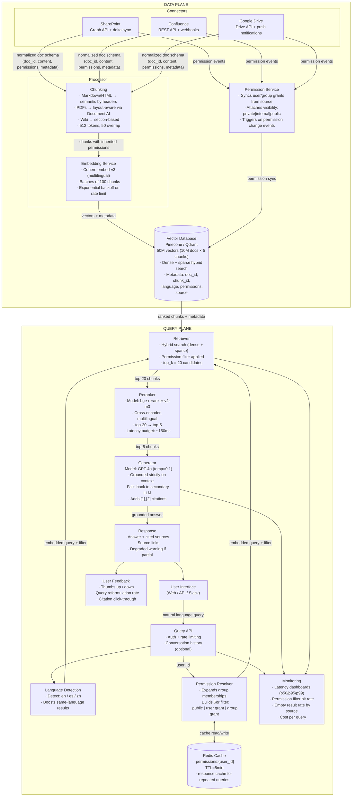

# Exercise 1: Enterprise RAG System

### Problem Statement

Design a RAG-based knowledge assistant for a large enterprise with the following requirements:

- 10 million documents from multiple sources (SharePoint, Confluence, Google Drive, internal wikis)
- 50,000 employees with role-based access
- Documents update continuously
- Must respect document permissions at query time
- Sub-3 second response time for 95% of queries
- Support for multiple languages (English, Spanish, Mandarin)

### Time Allocation (35 minutes)

| Phase | Time | Focus |
|-------|------|-------|
| Clarification | 3 min | Scope, priorities, constraints |
| High-level architecture | 7 min | Components and data flow |
| Data pipeline | 8 min | Ingestion, chunking, indexing |
| Query pipeline | 8 min | Retrieval, generation, permissions |
| Reliability and scale | 5 min | Failure handling, scaling |
| Evaluation | 4 min | Metrics and monitoring |

### Solution Walkthrough

#### Clarification Questions

```
1. What is the document size distribution? (PDFs, wikis, code?)
2. How often do permissions change? (Impacts caching strategy)
3. Is conversation history required or single-turn Q&A?
4. What is the accuracy bar? (Can we say "I don't know"?)
5. Are there compliance requirements? (Audit, data residency)
```

#### High-Level Architecture



#### Data Pipeline Deep Dive

**1. Connectors:**
```
Each source has a dedicated connector:
- SharePoint: Graph API with delta sync
- Confluence: REST API with webhooks
- Google Drive: Drive API with push notifications

Connector responsibilities:
- Fetch document content and metadata
- Track change events (create, update, delete)
- Extract permissions from source system
- Normalize to common document schema
```

**2. Document Schema:**
```json
{
  "doc_id": "uuid",
  "source": "sharepoint|confluence|gdrive",
  "source_id": "original_id_in_source",
  "title": "string",
  "content": "string",
  "content_type": "pdf|html|docx|md",
  "language": "en|es|zh",
  "permissions": {
    "users": ["user_id_1", "user_id_2"],
    "groups": ["group_id_1"],
    "visibility": "private|internal|public"
  },
  "metadata": {
    "author": "string",
    "created_at": "timestamp",
    "updated_at": "timestamp",
    "path": "folder/path"
  }
}
```

**3. Chunking Strategy:**
```
Given mixed document types, use adaptive chunking:

- Markdown/HTML: Semantic chunking by headers
- PDFs: Layout-aware chunking using document AI
- Wiki pages: Section-based chunking

Chunk parameters:
- Target size: 512 tokens
- Overlap: 50 tokens
- Preserve: headers, tables, code blocks

Each chunk inherits parent document permissions.
```

**4. Embedding:**
```
Multilingual requirement suggests:
- Model: Cohere embed-v3 (multilingual, good quality)
- Alternative: OpenAI text-embedding-3-large

Batch embedding:
- Process in batches of 100 chunks
- Rate limit handling with exponential backoff
- Store embedding with chunk in vector DB
```

**5. Vector Database Choice:**
```
Pinecone or Qdrant for this scale.

Selection criteria:
- Metadata filtering: Critical for permissions
- Scale: 10M docs × 5 chunks = 50M vectors
- Hybrid search: Needed for keyword queries

Schema:
- Vector: embedding
- Metadata: doc_id, chunk_id, language, permissions, source
```

#### Query Pipeline Deep Dive

**1. Permission Resolution:**
```python
def get_user_permissions(user_id: str) -> PermissionSet:
    """
    Resolve all documents user can access.
    Returns set of:
    - Direct user grants
    - Group memberships expanded
    - Public document access
    
    CACHED with 5-minute TTL since permissions change infrequently.
    """
    cache_key = f"permissions:{user_id}"
    if cached := cache.get(cache_key):
        return cached
    
    perms = permission_service.resolve(user_id)
    cache.set(cache_key, perms, ttl=300)
    return perms
```

**2. Retrieval with Filtering:**
```python
def retrieve(query: str, user_id: str, top_k: int = 20) -> List[Chunk]:
    perms = get_user_permissions(user_id)
    
    # Detect language for query
    lang = detect_language(query)
    
    # Build permission filter
    # User can see: public docs, their own, or groups they belong to
    filter = {
        "$or": [
            {"visibility": "public"},
            {"users": {"$in": [user_id]}},
            {"groups": {"$in": perms.groups}}
        ]
    }
    
    # Optional: boost same-language content
    if lang != "en":
        filter["language"] = lang
    
    results = vector_db.search(
        query_embedding=embed(query),
        top_k=top_k,
        filter=filter
    )
    return results
```

**3. Reranking:**
```
Rerank top-20 to get top-5 with cross-encoder.
Model: bge-reranker-v2-m3 (multilingual)
Latency budget: ~100ms
```

**4. Generation:**
```python
def generate(query: str, chunks: List[Chunk], user_id: str) -> Response:
    context = format_chunks_with_citations(chunks)
    
    prompt = f"""You are a knowledge assistant for [Company].
Answer the question using ONLY the provided context.
If the context does not contain the answer, say "I could not find information about that in our knowledge base."
Always cite sources using [1], [2] format.

CONTEXT:
{context}

QUESTION: {query}
"""
    
    response = llm.generate(
        prompt=prompt,
        model="gpt-4o",
        temperature=0.1
    )
    
    return format_with_source_links(response, chunks)
```

#### Scaling and Reliability

**Latency Budget (p95 < 3s):**
```
Permission resolution:   50ms  (cached)
Embedding:              100ms
Vector search:          100ms
Reranking:              150ms
LLM generation:        1500ms
Network/overhead:       100ms
─────────────────────────────
Total:                 2000ms (buffer for P95)
```

**Scaling Considerations:**
```
- Vector DB: Sharded by source or hash
- Embedding service: Horizontal scale, stateless
- LLM calls: Multiple providers for redundancy
- Cache: Redis cluster for permissions and responses
```

**Failure Handling:**
```
- Vector DB down: Return cached results + degraded warning
- LLM down: Fallback to secondary provider
- Rate limiting: Queue with backpressure
- Embedding service: Batch retries with circuit breaker
```

#### Evaluation Approach

**Offline Metrics:**
```
- Retrieval: Precision@5, Recall@5, MRR
- Generation: RAGAS (faithfulness, relevance)
- End-to-end: Answer correctness on test set
```

**Online Metrics:**
```
- User feedback: Thumbs up/down
- Query reformulation rate: User rephrasing indicates failure
- Citation click-through: Are sources useful?
```

**Monitoring:**
```
- Latency dashboards by percentile
- Permission filter hit rate
- Empty result rate by source
- Cost per query
```

---
