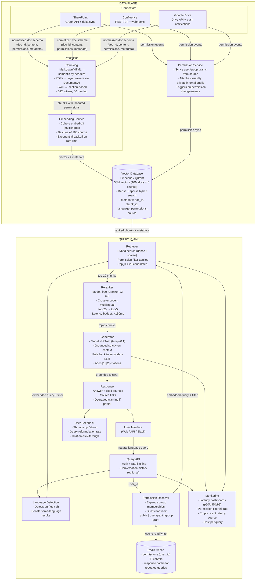

# Exercise 1: Enterprise RAG System

### Problem Statement

Design a RAG-based knowledge assistant for a large enterprise with the following requirements:

- 10 million documents from multiple sources (SharePoint, Confluence, Google Drive, internal wikis)
- 50,000 employees with role-based access
- Documents update continuously
- Must respect document permissions at query time
- Sub-3 second response time for 95% of queries
- Support for multiple languages (English, Spanish, Mandarin)

### Time Allocation (35 minutes)

| Phase | Time | Focus |
|-------|------|-------|
| Clarification | 3 min | Scope, priorities, constraints |
| High-level architecture | 7 min | Components and data flow |
| Data pipeline | 8 min | Ingestion, chunking, indexing |
| Query pipeline | 8 min | Retrieval, generation, permissions |
| Reliability and scale | 5 min | Failure handling, scaling |
| Evaluation | 4 min | Metrics and monitoring |

---

## Solution Walkthrough — Sr. AI Engineer Interview Narrative

### Phase 1: Clarification Questions (3 min)

Before diving into architecture, I'd start by scoping the problem tightly with the interviewer. These questions aren't just procedural — each one unlocks a design decision:

**"What does the document size distribution look like? Are we dealing mostly with PDFs, wiki pages, code files, or a mix?"**
This matters because chunking strategy is entirely dependent on content type. PDFs with complex layouts (tables, multi-column) need layout-aware parsing via something like Google Document AI or Unstructured.io, while Markdown and wiki pages can be chunked semantically by headers. If there's a heavy tail of very long documents (100+ page PDFs), I need to plan for hierarchical summarization on top of basic chunking.

**"How frequently do permissions change, and what's the blast radius of a permission change?"**
This is the most critical question for this system. If a single group permission change can affect thousands of documents, we can't resolve permissions at indexing time alone — we need query-time enforcement. But we also can't call the source system on every query because that would blow our latency budget. This tells me I need a caching layer with carefully chosen TTLs for permission resolution.

**"Is conversation history required, or is this single-turn Q&A?"**
Multi-turn dramatically changes the query pipeline. With conversation history, I'd need to add a query rewriting step that resolves coreferences ("what about the second one?", "tell me more") before embedding the query. For this design, I'll assume single-turn to keep scope manageable, but I'll note where conversation support plugs in.

**"What's the accuracy bar? Can the system say 'I don't know'?"**
This determines how aggressively I ground the generation. If false positives are worse than missing answers (like in legal or compliance contexts), I'll enforce strict grounding with an explicit "I don't know" fallback. If recall matters more, I'll use a broader retrieval window and more permissive generation.

**"Are there compliance requirements — audit logging, data residency, PII handling?"**
This affects where I host things. If there's data residency (EU data stays in EU), I might need region-specific vector DB deployments. Audit logging means every query and every document accessed gets logged, which adds a write path to the query pipeline.

---

### Phase 2: High-Level Architecture (7 min)

Here's how I'd draw this on the whiteboard. The system splits into two planes: the **Data Plane** handles offline ingestion and indexing, the **Query Plane** handles real-time user requests. This separation is intentional — the data plane can tolerate minutes of latency; the query plane has a hard 3-second p95 SLA.



Let me walk through the reasoning behind this split and each major component.

**Why two planes?**
The data plane is essentially an ETL pipeline. It runs asynchronously, can retry failures over minutes, and has completely different scaling characteristics than the query path. Connectors need to handle API rate limits from SharePoint, Confluence, and Google Drive. The processor needs GPU resources for embedding. None of this should share infrastructure with the real-time query path that has a 3-second SLA.

The query plane is a synchronous request/response pipeline with strict latency budgets for each stage. Keeping it separate means I can scale it independently and reason about its latency profile in isolation.

**Why the Permission Service is its own component:**
Permissions in enterprise environments are genuinely complex. You have direct user grants, group memberships (which can be nested — group A contains group B), org-level visibility levels, and time-based access. Pulling this out as a dedicated service means: (1) it has its own sync cadence with each source system, (2) it can cache and pre-expand group memberships, and (3) permission changes propagate through one place rather than being scattered across connectors.

---

### Phase 3: Data Pipeline Deep Dive (8 min)

#### 3.1 Connectors

Each source system has a dedicated connector, and each uses the source's native change-tracking mechanism:

- **SharePoint:** Microsoft Graph API with delta queries. Delta sync is key here — rather than re-crawling the entire SharePoint tenant, I request only documents that changed since the last sync token. This reduces API calls by orders of magnitude. Graph API also gives me permission data inline with the document metadata.

- **Confluence:** REST API with webhooks. I register webhooks for page creation, update, and deletion events. The webhook payload tells me which page changed, then I fetch the full content via REST. This is event-driven rather than poll-based, so I get near-real-time updates.

- **Google Drive:** Drive API with push notifications (via webhook). Similar pattern to Confluence — Google notifies me of changes, and I fetch the updated content. Google's permission model (viewers, commenters, editors, shared drives) maps to my internal permission schema.

Every connector normalizes its output to a common document schema. This is critical — I don't want downstream components to know or care whether a document came from SharePoint or Google Drive:

```json
{
  "doc_id": "uuid",
  "source": "sharepoint|confluence|gdrive",
  "source_id": "original_id_in_source",
  "title": "string",
  "content": "string",
  "content_type": "pdf|html|docx|md",
  "language": "en|es|zh",
  "permissions": {
    "users": ["user_id_1", "user_id_2"],
    "groups": ["group_id_1"],
    "visibility": "private|internal|public"
  },
  "metadata": {
    "author": "string",
    "created_at": "timestamp",
    "updated_at": "timestamp",
    "path": "folder/path"
  }
}
```

The `source_id` field is important for deduplication and update tracking. When a connector detects a change to a document, it uses `source` + `source_id` to find the existing record, re-processes only that document, and upserts the new chunks into the vector DB. This avoids full reindexing.

#### 3.2 Chunking Strategy

This is where a lot of RAG systems fail in practice. Naive fixed-size chunking destroys the semantic coherence of content, leading to retrieval results that have partial context and force the LLM to hallucinate the rest. My chunking strategy adapts to the document type:

**Markdown/HTML (wiki pages, Confluence):** Semantic chunking by headers. I split at `##` and `###` boundaries because the document author already organized the content into meaningful sections. If a section exceeds 512 tokens, I split further at paragraph boundaries within that section. The section header is prepended to every sub-chunk so the embedding captures the topic context — a chunk about "Authentication Flow" under the "Security" header gets the full "Security > Authentication Flow" prefix.

**PDFs:** This is the hardest format. I use layout-aware parsing (Google Document AI or Unstructured.io) to handle multi-column layouts, tables, headers/footers, and page breaks. A naive text extraction from a two-column PDF interleaves the columns, producing gibberish. Layout-aware parsing reconstructs the reading order. Tables are extracted as structured data and converted to Markdown format within the chunk, which LLMs handle much better than raw tabular text.

**Wiki pages (internal wikis):** Section-based chunking similar to Markdown, but I also handle wiki-specific elements like info boxes, warning callouts, and embedded macros by converting them to plain text with appropriate labels.

**Chunk parameters:**
- **Target size: 512 tokens.** This is a sweet spot — large enough to carry meaningful semantic content, small enough to fit multiple chunks into an LLM context window without wasting tokens. I've seen benchmarks showing that 256-512 tokens optimizes retrieval precision for most use cases.
- **Overlap: 50 tokens.** Overlap ensures that if a relevant passage spans a chunk boundary, at least one of the two chunks captures enough context. 50 tokens (roughly 2-3 sentences) is usually sufficient.
- **Preserve: headers, tables, code blocks.** These are never split mid-element. A table is always kept in one chunk, even if it pushes the chunk over 512 tokens. Splitting a table across chunks makes both halves useless.

Each chunk inherits its parent document's permissions. This is the link between the data plane and query-time access control — when I store a chunk in the vector DB, its metadata includes the permission set from the source document.

#### 3.3 Embedding

**Model choice: Cohere embed-v3 (multilingual)**

The multilingual requirement is the primary driver here. Cohere embed-v3 natively supports 100+ languages in a single model, which means a query in Spanish can match content written in English if the semantics align. This is massive for an enterprise with content authored across languages.

Why not OpenAI text-embedding-3-large? It's a strong alternative, but Cohere's model has a key advantage for this use case: it supports separate `search_document` and `search_query` input types, which improves retrieval quality because the model knows whether it's encoding a document or a query and optimizes the embedding accordingly.

**Batch processing:**
- Process in batches of 100 chunks to maximize throughput while staying within API rate limits.
- Exponential backoff with jitter on rate limit errors. The initial backoff is 1 second, doubling up to a 60-second cap. Jitter prevents thundering herd when multiple workers hit the rate limit simultaneously.
- For initial ingestion of 10M documents (~50M chunks), this is a multi-day job. I'd run it on a pool of workers pulling from a task queue (SQS, RabbitMQ, or Redis Streams) so I can scale horizontally and resume from failures.

#### 3.4 Vector Database Choice

**Pinecone or Qdrant**, depending on the enterprise's hosting requirements.

**Why these over alternatives?**

The three non-negotiable requirements for this use case are:

1. **Metadata filtering with vector search:** I need to apply permission filters *at search time*, not as a post-filter. If I retrieve top-20 results and then filter by permissions, I might end up with 2 results because the user doesn't have access to 18 of them. Both Pinecone and Qdrant support pre-filtering — the permission filter is applied during the ANN search, so all 20 returned results are ones the user can actually see.

2. **Scale to 50M vectors:** 10M documents × ~5 chunks per document on average. Both Pinecone (serverless) and Qdrant handle this comfortably. At this scale, I'd use Pinecone's serverless tier for managed simplicity or Qdrant with sharding for self-hosted control.

3. **Hybrid search (dense + sparse):** Some enterprise queries are keyword-heavy — product names, internal acronyms, error codes. Pure semantic search misses these because the embedding doesn't capture the exact surface form. Hybrid search combines dense (semantic) vectors with sparse (BM25/SPLADE) vectors, giving me the best of both worlds. Qdrant supports this natively with named vectors; Pinecone supports it via sparse-dense vectors.

**Schema stored per vector:**
- `doc_id`: link back to source document for citation
- `chunk_id`: unique identifier for deduplication and updates
- `language`: enables language-aware boosting
- `permissions`: user IDs, group IDs, and visibility level for query-time filtering
- `source`: which system the document came from (useful for source-specific debugging)

---

### Phase 4: Query Pipeline Deep Dive (8 min)

This is where the 3-second SLA lives, so every component has a latency budget.

#### 4.1 Request Flow

A user submits a natural language query through the Web UI, API, or Slack integration. The Query API authenticates the request, extracts the `user_id`, applies rate limiting, and kicks off two parallel operations:

1. **Language Detection** — Identifies the query language (en/es/zh) using a lightweight model (fastText's language ID model runs in <1ms). This is used downstream to boost same-language results in retrieval.

2. **Permission Resolution** — Resolves what the user is allowed to see.

These run in parallel because they're independent, and parallelizing them saves ~50ms off the critical path.

#### 4.2 Permission Resolution

This is the most security-critical component in the system:

```python
def get_user_permissions(user_id: str) -> PermissionSet:
    cache_key = f"permissions:{user_id}"
    if cached := cache.get(cache_key):
        return cached

    perms = permission_service.resolve(user_id)
    cache.set(cache_key, perms, ttl=300)
    return perms
```

The Permission Service expands group memberships recursively. If user Alice is in group "Engineering", and "Engineering" is a member of "All Employees", Alice's permission set includes both groups. This expansion is expensive (it may require multiple LDAP/AD lookups), so I cache the result in Redis with a 5-minute TTL.

**Why 5 minutes?** It's a tradeoff between security and performance. Permissions in most enterprises change on the order of hours or days. A 5-minute window means that in the worst case, a user retains access to a document for 5 minutes after their permission is revoked. For most enterprise use cases, this is acceptable. If the security team requires tighter bounds, I can drop to 1 minute at the cost of more cache misses and higher load on the permission service.

The resolved permissions become a metadata filter for the vector search:

```python
def retrieve(query: str, user_id: str, top_k: int = 20) -> List[Chunk]:
    perms = get_user_permissions(user_id)

    lang = detect_language(query)

    filter = {
        "$or": [
            {"visibility": "public"},
            {"users": {"$in": [user_id]}},
            {"groups": {"$in": perms.groups}}
        ]
    }

    if lang != "en":
        filter["language"] = lang

    results = vector_db.search(
        query_embedding=embed(query),
        top_k=top_k,
        filter=filter
    )
    return results
```

The `$or` filter says: show me chunks that are public, OR that have this user explicitly listed, OR that belong to any group the user is a member of. This filter is pushed down into the vector DB's ANN search, so it's applied *during* retrieval, not after.

The language boost is intentional but soft. If the query is in Spanish, I prefer Spanish content but don't exclude English results entirely. In practice, I'd implement this as a metadata weight rather than a hard filter, so a highly relevant English document still surfaces for a Spanish query.

#### 4.3 Retrieval: Why Hybrid Search

I retrieve top-20 candidates using hybrid search (dense + sparse). Here's why both matter:

**Dense (semantic) vectors** capture meaning. "How do I request time off?" and "PTO submission process" are semantically similar even though they share zero keywords. This handles the majority of natural language queries.

**Sparse (BM25/SPLADE) vectors** capture exact terms. If someone searches "ERR_CONN_REFUSED troubleshooting", dense search might return general networking content. Sparse search nails the exact error code. Enterprise knowledge bases are full of internal jargon, product codenames, and acronyms that semantic models haven't been trained on.

I use Reciprocal Rank Fusion (RRF) to merge the two result sets. RRF is simple and robust — it ranks each result by the harmonic mean of its position in the dense and sparse rankings, so a result that appears near the top of both lists gets the highest final score.

**Why top-20 and not top-5?** Because the reranker needs a large enough candidate pool to find the truly best results. Bi-encoder retrieval (the vector search) is fast but imprecise — it's optimized for recall. The reranker is slow but precise — it's optimized for precision. By retrieving 20 and reranking to 5, I get the speed of bi-encoder search with the accuracy of cross-encoder reranking.

#### 4.4 Reranking

**Model: bge-reranker-v2-m3 (multilingual cross-encoder)**

The reranker takes each (query, chunk) pair and scores their relevance using a cross-encoder. Unlike bi-encoders (which encode query and document independently), cross-encoders process the query and document *together*, allowing full attention between all tokens. This gives dramatically better relevance scoring but is too expensive to run on the entire corpus — hence the two-stage pipeline.

The reranker takes the 20 candidates from retrieval and produces the final top-5 that go to the LLM. The multilingual capability of bge-reranker-v2-m3 means it correctly scores cross-language relevance (Spanish query matched to English document).

**Latency budget: ~150ms** for reranking 20 candidates. This is achievable on a single GPU. If latency becomes an issue, I can batch requests or use ONNX-optimized inference.

#### 4.5 Generation

```python
def generate(query: str, chunks: List[Chunk], user_id: str) -> Response:
    context = format_chunks_with_citations(chunks)

    prompt = f"""You are a knowledge assistant for [Company].
Answer the question using ONLY the provided context.
If the context does not contain the answer, say "I could not find information about that in our knowledge base."
Always cite sources using [1], [2] format.

CONTEXT:
{context}

QUESTION: {query}
"""

    response = llm.generate(
        prompt=prompt,
        model="gpt-4o",
        temperature=0.1
    )

    return format_with_source_links(response, chunks)
```

**Model: GPT-4o at temperature 0.1**

I choose GPT-4o because it offers the best balance of quality and latency for grounded generation. Temperature 0.1 (not 0) because exactly 0 makes the output fully deterministic, which can cause repetitive phrasing. A small amount of temperature adds natural variation without hallucination risk.

**Key prompt design decisions:**

1. **"ONLY the provided context"** — This is the strictest grounding instruction. Without it, the model will happily fill in gaps with its parametric knowledge, which may be wrong or outdated for enterprise-specific content.

2. **Explicit "I don't know" instruction** — This is critical. In enterprise settings, a confidently wrong answer is far worse than no answer. The model needs explicit permission and instruction to refuse.

3. **Citation format [1], [2]** — Every claim in the answer is attributed to a specific source chunk. The `format_chunks_with_citations` function numbers each chunk and includes its source document title and URL. The `format_with_source_links` function post-processes the response to turn [1], [2] references into clickable links.

**Fallback strategy:** If GPT-4o is unavailable (outage, rate limit), I fall back to a secondary LLM (Claude, Gemini, or a self-hosted model). The prompt template is model-agnostic. I'd implement this with a simple provider abstraction that tries the primary, catches exceptions, and routes to the secondary. The response includes a "degraded mode" indicator so the user knows the answer quality might differ.

**Response format:**
The final response includes:
- The generated answer with inline citations
- A list of source documents with titles and direct links back to the source system
- A confidence indicator (based on reranker scores — if the top chunk scored below a threshold, I flag the response as low-confidence)
- A degraded-mode warning if any component fell back to a secondary

---

### Phase 5: Scaling and Reliability (5 min)

#### 5.1 Latency Budget Breakdown

Every millisecond is accounted for against the 3-second p95 SLA:

```
Permission resolution:   50ms  (cached in Redis, <5ms hit, 200ms miss)
Query embedding:        100ms  (single vector, API call)
Vector search:          100ms  (Pinecone/Qdrant with pre-filtering)
Reranking:              150ms  (20 candidates, cross-encoder on GPU)
LLM generation:        1500ms  (GPT-4o, streaming first token ~300ms)
Network/serialization:  100ms  (internal service calls, response formatting)
─────────────────────────────────
Total:                 2000ms  (1000ms buffer for p95 variance)
```

The 1-second buffer is intentional. P95 means 1 in 20 requests can be slow, and the long tail comes from: LLM generation variance (sometimes the model generates a longer response), cache misses on permissions, and cold vector DB segments. The buffer ensures I stay under 3 seconds even when multiple components hit their slow path simultaneously.

**Optimization levers if latency creeps up:**
- Stream the LLM response to the user (first token in ~300ms, rest streams in). This dramatically improves *perceived* latency even if total generation time is 2 seconds.
- Pre-compute and cache embeddings for the most common queries (top 1000 queries cover ~20% of traffic in most enterprise deployments).
- Run language detection and permission resolution in parallel (already in the design).
- Reduce reranker candidates from 20 to 10 if the reranker becomes the bottleneck.

#### 5.2 Scaling Strategy

**Vector DB:** Shard by document source or consistent hash of `doc_id`. Source-based sharding has the advantage of isolating failures — if the SharePoint shard goes down, Confluence and Google Drive content is still searchable. Hash-based sharding distributes load more evenly. I'd start with source-based sharding for operational simplicity and move to hash-based if any single source dominates.

**Embedding service:** Stateless, horizontally scalable. Each instance pulls work from the task queue, embeds a batch, and writes to the vector DB. No coordination needed between instances. Auto-scale based on queue depth.

**Query API:** Stateless, behind a load balancer. Auto-scale based on request rate. Each instance handles the full query pipeline. Redis is the only shared state (permission cache).

**LLM calls:** Multi-provider for redundancy. Primary: GPT-4o via Azure OpenAI (for enterprise SLA and data privacy). Secondary: Anthropic Claude via AWS Bedrock. The abstraction layer routes requests and handles failover transparently.

**Redis:** Redis Cluster with 3+ nodes for the permission cache. The dataset is small (50K users × small permission sets = ~50MB), so a single Redis node handles it, but I run a cluster for availability.

#### 5.3 Failure Handling

Each failure mode has a specific mitigation:

**Vector DB unavailable:**
Return cached results if available (I cache the top-5 results for each (query_hash, user_id) tuple with a 10-minute TTL). The response includes a degraded-mode warning: "Results may not reflect the latest documents." If no cache exists, return an honest error: "Search is temporarily unavailable."

**LLM provider down:**
Failover to the secondary provider. If both are down (extremely rare), return the retrieved chunks directly without generation — the user still gets relevant document links, just without a synthesized answer.

**Embedding service rate limited:**
For the data plane: exponential backoff with a circuit breaker. If the circuit opens, chunks accumulate in the task queue and are processed when the circuit closes. Data staleness is acceptable for minutes.
For the query plane: the query embedding is a single API call. If it fails, retry once. If it fails again, return an error. This path has no graceful degradation because without an embedding I can't search.

**Permission service unavailable:**
Fall back to the cached permissions (even if expired). Log a security warning. This is a conscious tradeoff — I prefer returning results with potentially stale (but recently valid) permissions over blocking the user entirely. The security team must sign off on this policy.

**Connector failures (source system down):**
The data plane connector retries with backoff. Existing indexed content remains searchable. The monitoring dashboard shows "last successful sync" per source, and alerts fire if a connector hasn't synced in >1 hour.

---

### Phase 6: Evaluation Approach (4 min)

#### 6.1 Offline Evaluation

Before deploying any change (new chunking strategy, different embedding model, prompt iteration), I run it through an offline evaluation suite:

**Retrieval quality:**
- **Precision@5:** Of the top-5 retrieved chunks, how many are actually relevant? This catches noise in retrieval.
- **Recall@5:** Of all relevant chunks in the corpus, how many did I find in the top 5? This catches under-retrieval.
- **MRR (Mean Reciprocal Rank):** How high does the first relevant result rank? This matters because the LLM pays more attention to earlier chunks in the context window.

**Generation quality (using RAGAS framework):**
- **Faithfulness:** Does the generated answer stay within the bounds of the provided context? This is the hallucination detector. RAGAS measures this by decomposing the answer into claims and checking each against the source chunks.
- **Answer relevance:** Does the answer actually address the question? An answer can be faithful to context but miss the point of the query.
- **Context precision:** Were the retrieved chunks relevant to the question? This measures retrieval quality from the generation perspective.

**End-to-end accuracy:**
I maintain a golden test set of ~500 question-answer pairs, curated by domain experts. Each pair includes the question, the expected answer, and the source documents. I run the full pipeline on this set and measure exact-match accuracy and semantic similarity (using an LLM-as-judge for nuanced comparison).

#### 6.2 Online Evaluation

Once deployed, I track real user signals:

**User feedback (thumbs up/down):**
The simplest and most valuable signal. I track the feedback rate (what % of responses get feedback at all) and the positive ratio. A drop in positive ratio is an early warning of quality regression. I also sample low-rated responses for manual review to identify systematic failure patterns.

**Query reformulation rate:**
If a user asks a question, gets a response, and immediately asks a rephrased version of the same question, that's a signal the first response was unsatisfying. I detect this by embedding consecutive queries from the same user and flagging pairs with >0.85 cosine similarity. A high reformulation rate indicates retrieval or generation problems.

**Citation click-through:**
When the response includes source links, do users click them? High click-through means users find the sources useful and are verifying the answer. Low click-through on most queries but high click-through on specific topics might indicate those topics need better coverage.

**Zero-result rate by source:**
If queries about SharePoint content consistently return no results while Confluence queries work fine, there's a connector or indexing problem specific to SharePoint. Breaking this metric down by source system makes root-cause analysis fast.

#### 6.3 Monitoring

**Latency dashboards:** p50, p95, p99 broken down by pipeline stage (embedding, retrieval, reranking, generation). If p95 generation latency creeps above 1.5 seconds, I know to investigate the LLM provider before it affects the overall SLA.

**Permission filter hit rate:** What percentage of vector search candidates are eliminated by the permission filter? If this rate is very high (say 90%), it means most content is private and the effective search space per user is small. This might require increasing `top_k` before filtering or rethinking the indexing strategy.

**Cost per query:** LLM calls dominate cost. I track: average tokens per query (input + output), cost per query by model, and total daily spend. This lets me set alerting thresholds and plan capacity. At 50K employees, even moderate usage (5 queries/user/day) is 250K queries/day. At ~$0.01/query for GPT-4o, that's $2,500/day or ~$75K/month on LLM costs alone. This makes the case for response caching — if 20% of queries are repeated, caching saves $15K/month.

**Freshness monitoring:** For each source system, I track the lag between a document being updated in the source and the updated embedding being available in the vector DB. Target: <15 minutes for webhook-based sources (Confluence, Google Drive), <1 hour for poll-based sources (SharePoint delta sync).

---

### Key Tradeoffs to Highlight in the Interview

| Decision | Alternative | Why I chose this |
|----------|------------|-----------------|
| Query-time permission filtering | Index-time permission separation (separate indexes per group) | Permissions change frequently; maintaining N indexes is operationally expensive and cross-group queries become impossible |
| Cohere embed-v3 | OpenAI text-embedding-3-large | Native multilingual support and search_document/search_query distinction; OpenAI is a strong alternative if already in the vendor stack |
| 5-minute permission cache TTL | No cache (real-time) or 1-hour cache | Balances security (stale window is small) with performance (95%+ cache hit rate at 5 min) |
| Two-stage retrieval (bi-encoder + cross-encoder reranker) | Single-stage retrieval | Cross-encoder quality is dramatically better but too slow for first-stage retrieval; two stages give both speed and quality |
| Hybrid search (dense + sparse) | Dense-only | Enterprise content is full of exact terms (product names, error codes) that pure semantic search misses |
| GPT-4o for generation | Self-hosted open-source LLM | Quality gap is still significant for grounded generation with citations; self-hosted reduces cost but increases operational burden and quality risk |
| Streaming response | Wait for full response | Perceived latency drops from 2s to ~300ms for first token; users start reading immediately |

---
