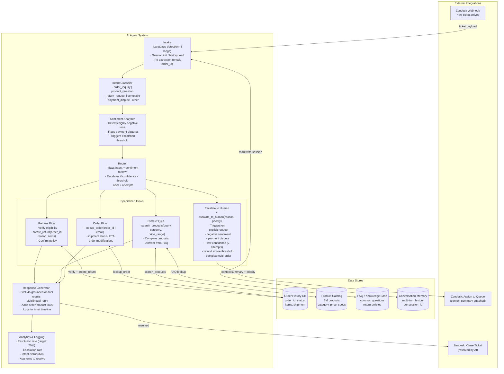

# Exercise 2: Customer Support Chatbot

### Problem Statement

Design an AI-powered customer support system for an e-commerce company:

- Handle 10,000 conversations per day
- Access to product catalog (1M products), order history, FAQs
- Goal: Resolve 70% of tickets without human handoff
- Support order lookup, returns, product questions
- Multilingual support (3 languages)
- Integration with existing Zendesk ticketing

### Solution Highlights

**Key Architectural Decisions:**

1. **Agent Architecture with Flow Control:**


2. **Tool Design:**
```python
tools = [
    {
        "name": "lookup_order",
        "description": "Look up order details by order ID or customer email",
        "parameters": {
            "order_id": "optional string",
            "email": "optional string"
        }
    },
    {
        "name": "search_products",
        "description": "Search product catalog",
        "parameters": {
            "query": "string",
            "category": "optional string",
            "price_range": "optional tuple"
        }
    },
    {
        "name": "create_return",
        "description": "Initiate a return for an order",
        "parameters": {
            "order_id": "string",
            "reason": "string",
            "items": "list of item IDs"
        }
    },
    {
        "name": "escalate_to_human",
        "description": "Transfer to human agent",
        "parameters": {
            "reason": "string",
            "priority": "low|medium|high"
        }
    }
]
```

3. **Escalation Criteria:**
```
Escalate to human when:
- Customer explicitly requests human
- Sentiment is highly negative (detected by classifier)
- Issue involves payment disputes
- Agent confidence is low after 2 attempts
- Complex multi-order issues
- Refund above threshold amount
```

4. **Integration Pattern:**
```
Zendesk integration:
- Webhook receives new tickets
- AI handles via API
- Resolution → close ticket
- Escalation → assign to queue with context summary
- All interactions logged to ticket timeline
```

---
