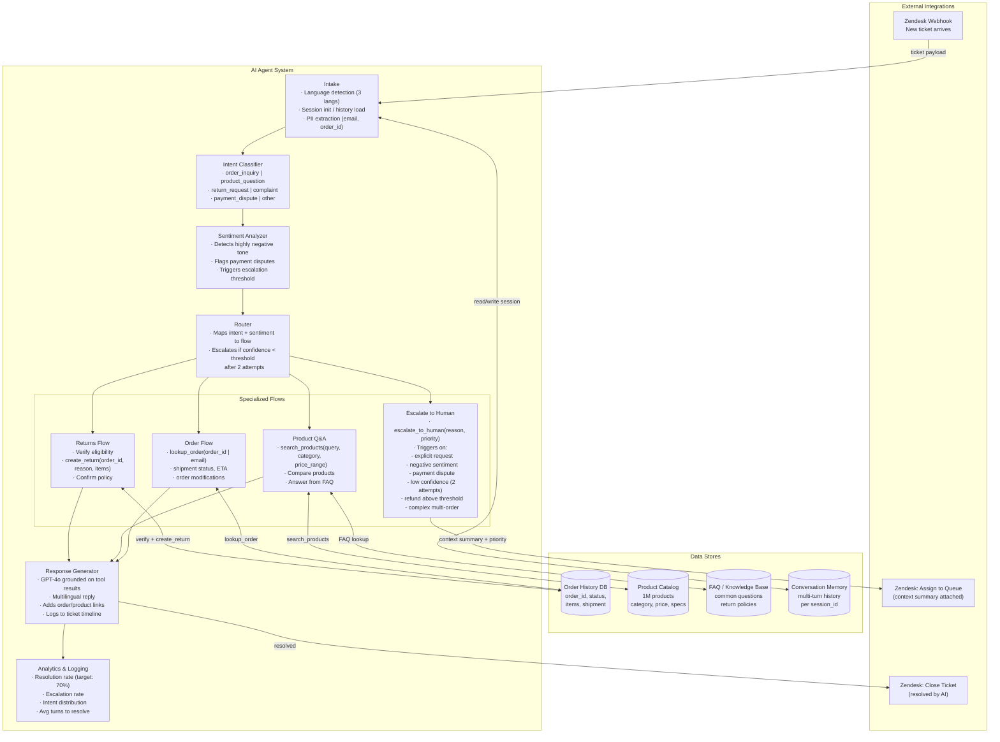

# Exercise 2: Customer Support Chatbot

### Problem Statement

Design an AI-powered customer support system for an e-commerce company:

- Handle 10,000 conversations per day
- Access to product catalog (1M products), order history, FAQs
- Goal: Resolve 70% of tickets without human handoff
- Support order lookup, returns, product questions
- Multilingual support (3 languages)
- Integration with existing Zendesk ticketing

### Time Allocation (35 minutes)

| Phase | Time | Focus |
|-------|------|-------|
| Clarification | 3 min | Scope, priorities, constraints |
| High-level architecture | 7 min | Agent system, data stores, integrations |
| Intent routing and flows | 8 min | Classification, specialized flows, tool use |
| Conversation management | 5 min | Memory, multi-turn, context handling |
| Escalation and safety | 5 min | Handoff logic, guardrails, edge cases |
| Reliability and evaluation | 7 min | Metrics, monitoring, failure handling |

---

## Solution Walkthrough — Sr. AI Engineer Interview Narrative

### Phase 1: Clarification Questions (3 min)

I'd open by asking five targeted questions, each of which shapes a fundamental design decision:

**"What's the current resolution rate with human agents, and what does a 'resolved' ticket look like?"**
This calibrates the 70% automation target. If human agents currently resolve 85% on first contact, 70% AI resolution is ambitious but realistic — it means the AI needs to handle the straightforward 70% and route the remaining 30% (complex, emotional, edge-case) to humans. I also need a clear definition of "resolved": does it mean the customer explicitly confirmed satisfaction, or does it mean the agent took the correct action (e.g., initiated a return)? This affects how I measure success and when I close a ticket.

**"What percentage of tickets fall into each category — order inquiries, product questions, returns, complaints, other?"**
Intent distribution determines where I invest design effort. If 60% of tickets are "where is my order?" and 20% are returns, I build those two flows with deep integration and rich error handling, and I can afford a simpler treatment for the long tail. Most e-commerce support follows a Pareto distribution — a small number of intent types cover the vast majority of tickets.

**"Are there actions the AI must never take without human approval?"**
This is the guardrails question. Refunds above a certain dollar amount, account modifications, cancellation of high-value orders — these likely need human-in-the-loop approval. Knowing the boundary between autonomous actions and approval-required actions determines my escalation thresholds and prevents the AI from making costly mistakes.

**"What does the current Zendesk workflow look like? Are there macros, routing rules, or SLA timers we need to preserve?"**
I'm not replacing Zendesk — I'm augmenting it. If the support team has existing routing rules (e.g., VIP customers go to a dedicated queue), my AI system needs to respect those. If there are SLA timers (first response within 5 minutes), my system must respond fast enough to meet them. Integration friction is the #1 reason AI support projects fail in practice.

**"What customer data is available at ticket creation time? Do we get the customer's email, order ID, or account info upfront?"**
This determines whether the AI needs to ask identifying questions before it can do anything useful. If Zendesk tickets arrive with the customer's email pre-populated (common when tickets come from authenticated users), I can immediately pull their order history. If tickets arrive from anonymous channels (social media, general email), the AI's first job is identity resolution — and that adds turns to the conversation.

---

### Phase 2: High-Level Architecture (7 min)

The system has three layers: **External Integrations** (Zendesk, the source of truth for tickets), **Data Stores** (the backend systems the AI queries), and the **AI Agent System** (the orchestration brain). Let me draw this out and explain each.



**Why an agent architecture with explicit flows instead of a single free-form LLM?**

This is the most important architectural decision, so let me explain the reasoning. A free-form "just call GPT-4o with all the tools" approach sounds simpler, but it fails in production for three reasons:

1. **Reliability.** When the LLM decides freely which tool to call and in what order, its behavior is non-deterministic. Sometimes it will check order status before asking for the order ID. Sometimes it will skip eligibility checks before initiating a return. Explicit flows enforce business logic sequences that must happen in order.

2. **Safety.** The returns flow has a hard rule: verify eligibility before creating a return. In a free-form agent, the LLM might skip verification if the customer is persuasive enough. Explicit flow control means the code, not the LLM, enforces policy.

3. **Debuggability.** When a ticket goes wrong, I need to know exactly what happened. With explicit flows, I have structured logs: "Intake → classified as return_request (0.94) → Returns Flow → eligibility check failed (outside return window) → informed customer." With a free-form agent, I have an opaque chain of LLM calls.

The LLM still provides the intelligence — it handles natural language understanding, generates human-like responses, and makes nuanced judgment calls. But the control flow is deterministic code.

---

### Phase 3: Agent Pipeline — Step by Step (8 min)

#### 3.1 Intake

Every conversation starts here. The Intake module does three things simultaneously:

**Language detection:** I use fastText's language ID model (runs in <1ms) to detect the customer's language from their first message. This sets the response language for the entire conversation. If the customer switches languages mid-conversation (which happens), I re-detect on each turn and match. The key insight is that I don't translate the customer's message to English for processing — I keep it in the original language and use a multilingual LLM for everything downstream. Translation introduces errors and loses nuance, especially for complaints where tone matters.

**Session initialization:** I check if this is a new conversation or a continuation. Zendesk tickets have a ticket ID that maps to my `session_id`. If the customer sent a follow-up on the same ticket, I load the full conversation history from the Conversation Memory store. This gives the LLM context on what's already been discussed, what tools have been called, and what the current state of the issue is. Without this, the AI would ask the customer to repeat their order ID on every message.

**PII extraction:** I scan the customer's message for structured identifiers — email addresses, order IDs (which follow a known pattern like `ORD-XXXXXX`), product names. These are extracted and stored as session metadata so downstream flows can use them directly without the LLM having to re-extract them. I also flag PII for audit logging — customer emails and order IDs appear in logs, but I redact things like credit card numbers or SSNs before they enter the system.

#### 3.2 Intent Classification

The intent classifier determines which specialized flow handles this request. I use a two-level approach:

**Primary intents:**
- `order_inquiry` — "Where is my order?", "When will it arrive?", "Can I change my shipping address?"
- `product_question` — "Does this laptop have USB-C?", "Which running shoes do you recommend?"
- `return_request` — "I want to return this", "The product arrived damaged"
- `complaint` — "This is unacceptable", "I've been waiting 3 weeks"
- `payment_dispute` — "I was charged twice", "I see an unknown charge"
- `other` — Anything that doesn't fit the above categories

**Why not let the LLM classify directly?** I could include intent classification in the LLM prompt, and it would work decently. But a dedicated classifier (a fine-tuned BERT or even a prompted smaller model like GPT-4o-mini) gives me two advantages: (1) it returns a confidence score, which I use for escalation logic ("if confidence < 0.7 after 2 attempts, escalate"), and (2) it's 10x faster and cheaper than running the full LLM just for classification.

**How I'd train the classifier:** Start with a prompted GPT-4o-mini for the first few weeks, logging every classification with the raw message. After accumulating ~5,000 labeled examples from production traffic, fine-tune a lightweight model (DistilBERT or a small encoder) that runs in <10ms. The fine-tuned model is faster, cheaper, and can be deployed on-premise if needed.

**Multi-intent handling:** Customers often combine intents: "I want to return the shoes from order ORD-12345 and also, do you have them in size 11?" I handle this by detecting the primary intent (return_request) and adding secondary intents to the session context. The Returns Flow processes the return, and then the system loops back to handle the product question.

#### 3.3 Sentiment Analysis

Sentiment runs in parallel with intent classification. I care about three signals:

**Negative sentiment intensity:** Not just "positive/negative" but a gradient. "It hasn't arrived yet" is mildly negative and doesn't need escalation. "This is the third time I'm contacting you and nobody helps me, I'm disputing this with my bank" is highly negative and needs immediate human attention.

**Frustration escalation across turns:** If the customer starts neutral but becomes increasingly negative over 3-4 turns, that's a sign the AI isn't resolving the issue. I track sentiment across the conversation and trigger escalation if there's a downward trend, even if no single message crosses the threshold.

**Payment/legal language detection:** Keywords like "chargeback", "lawsuit", "fraud", "BBB complaint" trigger an immediate escalation regardless of overall sentiment. These aren't things an AI should attempt to handle.

I implement this with GPT-4o-mini as a structured output call — the model returns `{"sentiment": "negative", "intensity": 0.85, "escalation_triggers": ["repeated_contact", "chargeback_threat"]}`. It's fast (~100ms), reliable for this task, and the structured output ensures I always get parseable results.

#### 3.4 Router

The Router is deterministic code, not an LLM. It takes intent + sentiment + confidence and applies explicit rules:

```
IF payment_dispute → ALWAYS escalate (high priority)
IF explicit human request → ALWAYS escalate (medium priority)
IF sentiment.intensity > 0.8 → escalate (high priority)
IF intent confidence < 0.7 AND attempt_count >= 2 → escalate (medium priority)
IF intent == order_inquiry → Order Flow
IF intent == product_question → Product Q&A Flow
IF intent == return_request → Returns Flow
IF intent == complaint AND sentiment.intensity < 0.8 → attempt resolution, then escalate if unresolved
IF intent == other → attempt with general FAQ, escalate if unresolved
```

The "2 attempts" rule is important. On the first low-confidence classification, the AI asks a clarifying question: "I want to make sure I help you with the right thing — are you asking about an existing order, or looking for product information?" If the second classification is still low confidence, the AI routes to a human rather than continuing to fumble.

---

### Phase 4: Specialized Flows Deep Dive (8 min)

#### 4.1 Order Flow

This is the highest-volume flow (typically 40-50% of tickets in e-commerce). The tool interface:

```python
tools = [
    {
        "name": "lookup_order",
        "description": "Look up order details by order ID or customer email",
        "parameters": {
            "order_id": "optional string",
            "email": "optional string"
        }
    }
]
```

**Why both `order_id` and `email`?** Customers don't always have their order ID. "I ordered some shoes last week and they haven't arrived" — no order ID, but if I have their email (from the Zendesk ticket or from the Intake PII extraction), I can pull all recent orders and let the customer identify which one. The tool returns the last 10 orders for an email lookup, and the AI asks "I see you have two recent orders — ORD-78432 (Nike Air Max, placed March 18) and ORD-78501 (Adidas Ultraboost, placed March 20). Which one are you asking about?"

**Order flow logic:**

1. **Identify the order.** Use the order ID if provided, otherwise look up by email and disambiguate.
2. **Fetch current status.** The Order History DB returns: order status (processing, shipped, delivered, returned), shipment tracking number and carrier, estimated delivery date, items in the order.
3. **Answer the question.** The LLM receives the structured order data and the customer's question, and generates a natural language response: "Your order ORD-78432 shipped on March 19 via FedEx (tracking: 1234567890). The estimated delivery is March 22. Here's the tracking link: [link]."
4. **Handle modifications.** If the customer wants to change their shipping address or cancel an order, the flow checks if the order status allows it (can't change address after shipment). If modification is possible, the AI confirms the change with the customer before executing. If not possible, it explains why and offers alternatives.

**Why not just give the LLM raw SQL access?** A tool abstraction is critical for three reasons: (1) security — the LLM never sees or constructs SQL, which prevents injection; (2) business logic — the tool enforces that customers can only see their own orders; (3) data shaping — the tool returns only the fields the LLM needs, not the entire order record with internal fields.

#### 4.2 Product Q&A Flow

This flow combines structured catalog search with unstructured FAQ retrieval:

```python
tools = [
    {
        "name": "search_products",
        "description": "Search product catalog",
        "parameters": {
            "query": "string",
            "category": "optional string",
            "price_range": "optional tuple"
        }
    }
]
```

**Product search** is a hybrid of keyword and semantic search over the 1M product catalog. "Waterproof hiking boots under $150" needs: semantic understanding of "waterproof hiking boots", structured filtering on `price < 150`. I implement this with Elasticsearch (for structured attributes + BM25) combined with a vector index (for semantic similarity), merged via reciprocal rank fusion — the same pattern I'd use in the RAG system.

**FAQ retrieval** is a mini-RAG pipeline. The FAQ knowledge base contains return policies, shipping information, warranty details, size guides, and general company info. I embed these as chunks in a vector store and retrieve the top-3 relevant chunks when the product flow needs policy information. "What's your return policy on sale items?" doesn't need the product catalog — it needs the FAQ.

**Product comparison** is a common sub-flow. "What's the difference between the X500 and the X700?" The AI searches for both products, retrieves their specs, and generates a structured comparison. The response includes a formatted table of key differences and a recommendation based on the customer's stated needs.

#### 4.3 Returns Flow

The most action-critical flow — it modifies state and has real financial impact:

```python
tools = [
    {
        "name": "create_return",
        "description": "Initiate a return for an order",
        "parameters": {
            "order_id": "string",
            "reason": "string",
            "items": "list of item IDs"
        }
    }
]
```

**This flow has mandatory steps that cannot be skipped:**

1. **Identify the order and items.** Same as Order Flow — look up by order ID or email, confirm which items the customer wants to return.

2. **Verify eligibility.** This is policy enforcement, not LLM judgment. The code checks: Is the order within the return window (e.g., 30 days)? Is the item in a returnable category (some items like custom orders or perishables aren't)? Has the customer already returned this item? These are hard business rules that the LLM doesn't decide — the tool returns `eligible: true/false` with a reason.

3. **Confirm with the customer.** Before executing `create_return`, the AI summarizes what's about to happen: "I'll initiate a return for the Nike Air Max (size 10) from order ORD-78432. You'll receive a prepaid shipping label via email and a refund of $129.99 to your original payment method within 5-7 business days. Should I proceed?" This confirmation step is non-negotiable — it prevents the AI from initiating returns based on misunderstood requests.

4. **Execute the return.** Call `create_return` with the confirmed parameters. The tool creates the return in the order system, generates the shipping label, and returns a confirmation with the return ID and next steps.

5. **Handle ineligible returns.** If the eligibility check fails, the AI explains why ("This order was placed 45 days ago, and our return window is 30 days") and offers alternatives ("I can connect you with a specialist to discuss an exception, or I can help you with a warranty claim if the product is defective"). This is where the LLM's natural language ability shines — it turns a policy rejection into a helpful interaction.

**Refund thresholds:** Returns above a dollar threshold (e.g., $500) are automatically escalated to a human agent for approval. The AI tells the customer: "I've started the process for your return. Because of the order value, a team member will review and confirm within 24 hours." This prevents the AI from issuing large refunds autonomously.

#### 4.4 Escalation to Human

Escalation isn't a failure — it's a feature. The 70% automation target explicitly expects 30% of tickets to reach humans. The quality of the escalation handoff directly affects the human agent's efficiency.

```python
tools = [
    {
        "name": "escalate_to_human",
        "description": "Transfer to human agent",
        "parameters": {
            "reason": "string",
            "priority": "low|medium|high"
        }
    }
]
```

**What happens on escalation:**

1. **Context summary generation.** The AI generates a structured summary for the human agent: what the customer wants, what's been tried, what the current state is, and why the AI escalated. Example: "Customer contacted about order ORD-78432 (Nike Air Max, $129.99). Wants to return outside the 30-day window because the product is defective. Eligibility check failed on time window. Customer is frustrated (sentiment: 0.75). Recommended action: evaluate warranty exception." This summary saves the human agent 2-3 minutes of reading chat history.

2. **Priority assignment.** `high` for payment disputes, chargeback threats, and very negative sentiment. `medium` for policy exceptions and unresolved complaints. `low` for general requests that just need a human touch (e.g., complex multi-order questions).

3. **Zendesk ticket update.** The escalation writes the context summary as an internal note on the Zendesk ticket, assigns it to the appropriate queue based on intent + priority, and adds relevant tags (e.g., "ai_escalated", "payment_dispute", "return_exception"). The human agent sees the full AI conversation, the context summary, and any tool results — they pick up right where the AI left off.

4. **Customer communication.** The AI tells the customer: "I'm connecting you with a team member who can help with this. I've shared our conversation so you won't need to repeat anything. You should hear back within [SLA time]." Transparency matters — the customer should know they're talking to an AI and when they're being transferred.

**Escalation triggers in priority order:**

| Trigger | Priority | Rationale |
|---------|----------|-----------|
| Customer explicitly asks for a human | medium | Always respect this — forcing AI interaction destroys trust |
| Payment dispute / chargeback language | high | Legal and financial risk; AI must not attempt resolution |
| Sentiment intensity > 0.8 | high | Highly frustrated customers need empathy that AI can't reliably deliver |
| Refund above threshold ($500) | medium | Financial controls require human approval |
| Intent confidence < 0.7 after 2 attempts | medium | AI doesn't understand the request; continuing wastes the customer's time |
| Complex multi-order issue | medium | Multiple order lookups, cross-referencing, exceptions — too many failure points for automation |

---

### Phase 5: Conversation Management (5 min)

#### 5.1 Multi-Turn Memory

Customer support is inherently multi-turn. A typical return conversation takes 4-6 turns: greeting → identify order → verify eligibility → confirm return → execute → confirmation. The AI must maintain coherent context across all turns.

**Conversation Memory Store:** I use Redis for active sessions and persist completed conversations to a relational database (Postgres). The schema per session:

```json
{
  "session_id": "zendesk_ticket_12345",
  "customer_id": "cust_67890",
  "language": "en",
  "turns": [
    {
      "role": "customer",
      "content": "I want to return the shoes I bought",
      "timestamp": "2026-03-25T10:00:00Z"
    },
    {
      "role": "assistant",
      "content": "I'd be happy to help with a return. Could you share your order number?",
      "timestamp": "2026-03-25T10:00:02Z",
      "intent": "return_request",
      "tools_called": []
    },
    {
      "role": "customer",
      "content": "ORD-78432",
      "timestamp": "2026-03-25T10:01:15Z"
    },
    {
      "role": "assistant",
      "content": "I found your order...",
      "timestamp": "2026-03-25T10:01:17Z",
      "tools_called": ["lookup_order(ORD-78432)"]
    }
  ],
  "extracted_entities": {
    "order_id": "ORD-78432",
    "email": "customer@email.com"
  },
  "current_flow": "return_flow",
  "flow_state": "awaiting_confirmation"
}
```

**Why store `flow_state`?** Between turns, I need to know where in the flow the conversation left off. If the AI asked "Should I proceed with the return?" and the customer said "yes", the system needs to know that "yes" is a confirmation to the pending return, not a new request. The `flow_state` is a finite state machine: `identifying_order → checking_eligibility → awaiting_confirmation → executing → completed`.

**Context window management:** For multi-turn conversations, I include the last 10 turns in the LLM prompt. For longer conversations (rare in support), I summarize older turns into a paragraph and prepend it. This keeps the prompt within token limits while preserving essential context.

#### 5.2 Response Generation

The Response Generator is the final LLM call in the pipeline. By this point, all tool calls have been made and all data has been gathered. The generator's job is to synthesize everything into a natural, helpful, on-brand response:

**Prompt structure:**

```
System: You are a customer support assistant for [Company]. You are helpful, concise, and
empathetic. Use the tool results below to answer the customer's question. Never make up
information — only use what the tools returned. If you can't resolve the issue, explain
what you've found and offer next steps. Respond in the same language as the customer.

Tool Results:
- lookup_order(ORD-78432): {status: "shipped", carrier: "FedEx", tracking: "1234567890",
  eta: "March 22", items: [{name: "Nike Air Max", size: "10", price: 129.99}]}

Conversation History:
[last 10 turns]

Customer's latest message: "When will my shoes arrive?"
```

**Model: GPT-4o at temperature 0.3**

Slightly higher temperature than the RAG system (0.1) because support responses benefit from natural variation. If every "where is my order" response sounds identical, it feels robotic. Temperature 0.3 adds enough variation to feel natural while staying grounded in the tool results.

**Response enrichment:** The generator adds actionable elements — tracking links, product page links, return portal links. These are templated (not LLM-generated) to ensure they're always correct. The LLM generates the natural language wrapper, and the post-processor injects the correct URLs.

**Multilingual generation:** The system prompt says "respond in the same language as the customer." GPT-4o handles this natively. I don't translate the response after generation — the model generates directly in the target language. This produces more natural responses than translate-after-generation, especially for languages with different formality levels (Spanish usted/tú, Mandarin formal/informal).

---

### Phase 6: Zendesk Integration (3 min)

The integration is bidirectional and non-invasive — I'm not replacing Zendesk, I'm acting as an agent within it.

**Inbound (Zendesk → AI):**
A Zendesk webhook fires on every new ticket and every customer reply. The payload includes the ticket ID, customer info, message content, and ticket metadata (tags, priority, custom fields). My service receives this webhook, maps it to a session, and runs the agent pipeline. Webhook delivery is at-least-once, so I implement idempotency on the session — if the same message arrives twice, the second invocation is a no-op.

**Outbound (AI → Zendesk):**
After the agent generates a response, I write it back via the Zendesk API as a public reply on the ticket. I also write internal notes (tool call results, classification, sentiment score) that are visible to human agents but not to the customer. This gives the support team full visibility into what the AI did and why.

**Resolution flow:**
When the AI resolves an issue (confirmed by the customer or by successful action completion), it updates the ticket status to "solved" via the Zendesk API. Zendesk's automation then sends the standard satisfaction survey. If the customer replies after resolution, the ticket reopens and the webhook fires again — the AI re-loads the session context and continues.

**Escalation flow:**
On escalation, the AI writes the context summary as an internal note, changes the ticket assignee to the appropriate group (based on intent and priority), and adds tags ("ai_escalated", the detected intent, the priority level). The human agent sees the full conversation plus the structured handoff note.

**Why not build a custom UI?** The support team already lives in Zendesk. Introducing a new tool means training, adoption friction, and maintaining two systems. By operating as a Zendesk agent, the AI fits into existing workflows. Human agents see AI responses in the same timeline as their own. Managers use existing Zendesk dashboards and reports. The AI is invisible infrastructure, not a new product the team has to adopt.

---

### Phase 7: Reliability, Scaling, and Failure Handling (5 min)

#### 7.1 Scale Math

10,000 conversations/day = ~7 conversations/minute during peak hours (assuming 10-hour business day with 2x peak factor). Each conversation averages 4-6 turns, so ~35-40 LLM calls per minute at peak. This is well within a single API account's rate limits for GPT-4o.

**Latency budget per turn:**

```
Intent classification:      50ms   (lightweight model or GPT-4o-mini)
Sentiment analysis:         80ms   (GPT-4o-mini structured output, parallel with classification)
Tool execution:            200ms   (database queries, product search)
Response generation:      1200ms   (GPT-4o)
Zendesk API write:         150ms   (async, doesn't block response)
──────────────────────────────────
Total:                    ~1500ms  (customer sees response in ~1.5s)
```

This is fast enough to feel conversational. Zendesk's typical SLA is "first response within minutes" — responding in 1.5 seconds is a dramatic improvement.

#### 7.2 Scaling Strategy

**Stateless workers behind a queue:** The Zendesk webhook pushes messages to an SQS (or Redis Streams) queue. A pool of worker processes pulls messages and runs the agent pipeline. Each worker is stateless — all state is in Redis (conversation memory) and the databases. This means I can scale workers horizontally based on queue depth.

**Auto-scaling triggers:** Scale up when queue depth exceeds 10 messages (conversations are waiting) or when average processing time exceeds 3 seconds (workers are overloaded). Scale down after 5 minutes of low utilization.

**Database scaling:** The Order History DB and Product Catalog are read-heavy. Read replicas handle the support query load without impacting transactional systems. The FAQ knowledge base is small and fits in memory — the vector index for FAQ retrieval runs on a single node.

#### 7.3 Failure Handling

**LLM provider outage:** Failover to a secondary provider (Claude via Bedrock, Gemini via Vertex). The tool schemas and system prompts are model-agnostic. I test against all providers weekly to ensure compatibility. If all LLM providers are down (extremely rare), the system falls back to a rule-based responder that handles the top-3 intents with templated responses ("Your order [X] is currently [status]. Estimated delivery: [date].") and escalates everything else.

**Database unavailable (Order History, Product Catalog):** The AI acknowledges the limitation: "I'm having trouble accessing order information right now. Let me connect you with a team member who can help." It escalates with `reason: "system_error"` and `priority: "high"`. The customer isn't left hanging.

**Zendesk API failure:** Responses are written with retry logic (3 retries, exponential backoff). If the write ultimately fails, the response is stored in a dead letter queue and a reconciliation job retries every 5 minutes. The response is never lost.

**Webhook delivery failure:** Zendesk retries failed webhooks. My endpoint is idempotent, so duplicate deliveries are safe. If my service is completely down, Zendesk queues the webhooks and delivers them when the service recovers.

**Conversation Memory (Redis) failure:** If Redis is down, the AI can't load conversation history. For new conversations, this is fine — there's no history to load. For ongoing conversations, the AI loses context. I handle this by falling back to just the current message (losing multi-turn context) and adding a note: "I apologize, I don't have the context from our previous messages. Could you briefly summarize what we've discussed?" This is degraded but not broken.

---

### Phase 8: Evaluation and Monitoring (4 min)

#### 8.1 Primary Success Metric: Resolution Rate

The 70% target is the north star. I measure it as: tickets where the AI handled the entire conversation and the customer did not subsequently contact support about the same issue within 7 days. The 7-day lookback prevents counting tickets as "resolved" when the customer gives up and calls instead.

**Breakdown by intent type:**
- `order_inquiry`: Target 90% resolution (these are straightforward lookups)
- `product_question`: Target 80% (FAQ-backed, occasionally needs specialist)
- `return_request`: Target 65% (eligibility rules disqualify some, complex cases escalate)
- `complaint`: Target 40% (emotional situations often need human empathy)
- `payment_dispute`: Target 0% (always escalated by policy)

This weighted average of per-intent resolution rates should hit the 70% overall target given typical intent distributions.

#### 8.2 Quality Metrics

**Customer satisfaction (CSAT):** Tracked through Zendesk's post-resolution surveys. I compare AI-resolved CSAT vs. human-resolved CSAT. The goal isn't to match human agents (that's unlikely for complex cases) — it's to maintain >4.0/5.0 for AI-resolved tickets. If CSAT drops below 3.5 for any intent category, I investigate and potentially tighten the escalation threshold for that category.

**Average turns to resolution:** Fewer turns = faster resolution = happier customer. I track this per intent type. If the Order Flow is averaging 5 turns when it should be 2-3, there's a problem — maybe the AI is asking unnecessary clarifying questions or failing to extract the order ID from the initial message.

**Escalation quality:** When a human agent takes over an escalated ticket, they rate the handoff: "Was the context summary accurate?", "Did the AI correctly identify the issue?", "Was escalation appropriate?" Poor handoff ratings mean I need to improve the context summarization or recalibrate escalation thresholds.

#### 8.3 Operational Monitoring

**Latency dashboards:** p50, p95, p99 per pipeline stage. Alert if p95 exceeds 3 seconds for any stage.

**Intent distribution over time:** If the percentage of `other` (unrecognized) intents spikes, something changed — maybe a new product launch is generating a new category of questions, or the intent classifier is degrading. This triggers a review of recent `other` tickets to identify new intent patterns.

**Tool error rates:** Track failures per tool (lookup_order, search_products, create_return). A spike in `lookup_order` failures means the Order History DB might be having issues. A spike in `create_return` failures might mean the returns API changed its interface.

**Cost per resolution:** LLM cost per conversation (typically 4-6 API calls × ~$0.01 per call = ~$0.05/conversation). At 10,000 conversations/day, that's ~$500/day or ~$15,000/month on LLM costs. Compare this to the cost of human agents handling the same tickets (~$5-10/ticket for the 7,000 tickets the AI resolves) = $35,000-70,000/month in saved agent costs. The ROI is compelling — even with infrastructure costs, the system pays for itself within the first month.

---

### Key Tradeoffs to Highlight in the Interview

| Decision | Alternative | Why I chose this |
|----------|------------|-----------------|
| Explicit flow control with LLM for NLU | Pure agentic LLM (ReAct/tool-use) | Deterministic business logic, auditable, safer for actions with financial impact |
| Dedicated intent classifier | LLM-based classification | Confidence scores for escalation logic, 10x faster and cheaper, can fine-tune on production data |
| Zendesk-native integration | Custom support UI | Zero adoption friction for the support team, uses existing dashboards and SLAs |
| GPT-4o for generation | Self-hosted open-source | Quality gap matters in customer-facing responses; brand risk from poor language quality |
| Redis for conversation state | Postgres only | Sub-millisecond reads for active sessions; persist to Postgres for analytics on completion |
| Mandatory confirmation before actions | Auto-execute after classification | Prevents costly mistakes (wrong item returned, wrong order cancelled); adds one turn but worth the safety |
| 2-attempt threshold for low confidence | Escalate immediately on low confidence | Gives the AI a chance to clarify; immediate escalation would over-escalate and miss the 70% target |

---
