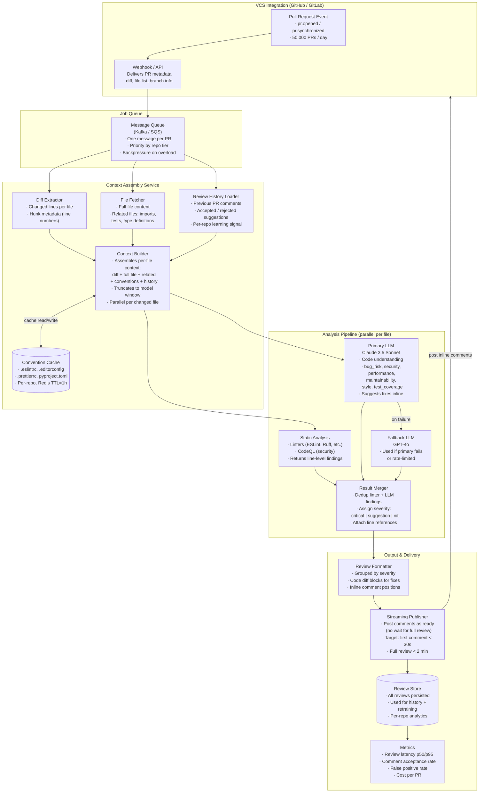

# Exercise 3: Code Review Assistant

### Problem Statement

Design a code review assistant for a development platform:

- Reviews pull requests automatically
- Provides specific, actionable feedback
- Respects repository style guides and conventions
- Can suggest code fixes
- Integration with GitHub/GitLab
- Handles 50,000 PRs per day

### Time Allocation (35 minutes)

| Phase | Time | Focus |
|-------|------|-------|
| Clarification | 3 min | Scope, priorities, constraints |
| High-level architecture | 7 min | Event flow, context assembly, analysis pipeline |
| Context assembly | 8 min | Diff extraction, related files, convention loading |
| Analysis pipeline | 8 min | Static analysis, LLM review, result merging |
| Output and delivery | 5 min | Formatting, streaming, GitHub integration |
| Evaluation and reliability | 4 min | Acceptance rate, false positives, scaling |

---

## Solution Walkthrough — Sr. AI Engineer Interview Narrative

### Phase 1: Clarification Questions (3 min)

**"What languages and frameworks are most common across the repos?"**
This determines which static analysis tools I integrate and how I tune the LLM prompts. A Python-heavy org means Ruff for linting and Bandit for security scanning. A TypeScript org means ESLint with type-aware rules. The LLM itself handles any language, but the static analysis layer is language-specific, and I need to know which integrations to prioritize. If the answer is "everything from Python to Rust to Terraform," I need a plugin architecture that loads the right toolchain per file extension.

**"What's the average PR size — number of changed files and lines?"**
This directly impacts my context assembly and LLM token strategy. If the median PR is 3 files and 50 changed lines, I can send full file context for every changed file in a single LLM call. If the p95 PR is 80 files and 3,000 changed lines (a large refactor or generated code), I need to chunk the review into per-file batches and assemble the final review from parallel results. The size distribution also tells me how to price the system — large PRs cost 20-50x more in LLM tokens than small ones.

**"How does the team currently handle code reviews? What are the biggest pain points?"**
If the pain point is "reviews take 2 days because senior engineers are bottlenecked," the AI assistant's value is speed — posting a first-pass review within minutes so the author can fix obvious issues before a human reviewer even looks at it. If the pain point is "we miss security vulnerabilities," the assistant's value is thoroughness — catching things humans overlook. This shapes whether I optimize for latency (first comment in <30 seconds) or depth (comprehensive multi-category analysis).

**"Is there an existing style guide or convention set, or does each team/repo have its own?"**
If there's a centralized style guide, I can encode it once and apply it globally. If conventions vary per repo (common in large orgs), I need a per-repo convention loading system that reads `.eslintrc`, `.editorconfig`, `.prettierrc`, `pyproject.toml`, and any custom rule files. This per-repo convention cache is a first-class component in the architecture.

**"What's the acceptance bar? Is it okay for the AI to occasionally suggest something incorrect, or does every comment need to be actionable?"**
False positives are the killer of code review tools. If developers see 3 bad suggestions in a row, they stop reading the AI's comments entirely. A 90% precision target means I need aggressive deduplication, severity calibration, and possibly a confidence threshold below which I suppress the comment. I'd rather post 5 highly accurate comments than 15 comments where 5 are noise.

---

### Phase 2: High-Level Architecture (7 min)

The system is an event-driven pipeline with four stages: **VCS Integration** receives PR events, **Context Assembly** gathers everything the reviewer needs to understand the change, **Analysis Pipeline** runs static tools and LLM review in parallel, and **Output & Delivery** formats and streams comments back to the PR.



**Why event-driven with a message queue instead of synchronous webhook processing?**

At 50,000 PRs/day, that's ~35 PRs/minute at uniform load, but PR submission patterns are spiky — Monday mornings and end-of-sprint days can hit 5-10x the average rate. A synchronous webhook handler would need to scale for peak, and slow reviews would block the webhook response, causing GitHub to retry and duplicate processing.

The message queue (Kafka or SQS) absorbs the spikes. PRs queue up during bursts and drain at the system's processing rate. Kafka gives me ordering guarantees if I need them (e.g., process the latest push to a PR before earlier ones), and SQS gives me simpler operations with built-in dead letter queues for failed reviews.

**Priority queuing:** Not all PRs are equal. I assign priority tiers based on: (1) repository importance (production services get higher priority than experimental repos), (2) PR size (small PRs review fast and clear quickly), and (3) author preference (some teams opt for "fast" mode). High-priority PRs are processed from the front of the queue; low-priority PRs process in FIFO order.

**Why process per-file in parallel?** A PR with 10 changed files doesn't need to wait for all 10 context assemblies to complete before analysis starts. As soon as one file's context is ready, it enters the analysis pipeline. This pipelining means the first review comment can appear on the PR while later files are still being analyzed — which is the key to hitting the "first comment in <30 seconds" target.

---

### Phase 3: Context Assembly Deep Dive (8 min)

This is the stage that separates a useful code review from a generic one. The quality of the review is bounded by the quality of the context the LLM receives.

#### 3.1 Diff Extraction

The webhook payload from GitHub includes the PR's head and base SHAs. I fetch the diff using the GitHub API (`GET /repos/{owner}/{repo}/pulls/{pull_number}/files`), which gives me per-file patches with hunk metadata: which lines changed, which lines were added vs. removed, and the surrounding context lines.

I parse this into a structured representation per file:

```json
{
  "filename": "src/auth/login.py",
  "status": "modified",
  "hunks": [
    {
      "start_line": 42,
      "end_line": 58,
      "added_lines": [45, 46, 47, 52, 53],
      "removed_lines": [45, 46],
      "patch": "@ -42,10 +42,14 @@ def authenticate(user, password):..."
    }
  ]
}
```

**Why not just send the raw unified diff?** Because the LLM needs to reference specific line numbers in its comments, and GitHub's inline comment API requires exact line positions in the diff. By parsing the hunks, I can map the LLM's findings back to precise positions in the PR diff view.

#### 3.2 Full File and Related File Fetching

The diff shows *what* changed, but the LLM needs to understand the *context* around the change. I fetch:

**The full file content** (post-change version). If a function was modified, the LLM needs to see the entire function signature, its callers, its return type, and the surrounding code to judge whether the change is correct. Reviewing a diff in isolation is like reading a sentence without the paragraph — you can spot syntax issues but not semantic bugs.

**Related files — this is the crucial differentiator.** I identify related files through three mechanisms:

1. **Import analysis.** If `login.py` imports from `auth_utils.py`, I fetch `auth_utils.py`. The LLM needs to know the signatures and behavior of functions being called in the changed code. I parse imports statically (AST parsing for Python, regex for TypeScript/Go) — no LLM call needed.

2. **Test files.** If `login.py` changes, I look for `test_login.py` or `login_test.py` (convention-based matching). If the test file wasn't changed in the PR, that's potentially a review finding: "Changed authentication logic but no corresponding test updates."

3. **Type definitions.** In TypeScript/Java/Go, I fetch relevant type/interface definitions that the changed code references. The LLM can't review a function that takes a `UserSession` parameter without knowing what `UserSession` contains.

**Token budget management:** Related files can blow up the context window. I apply a priority order: changed file's full content (must include) → imported files that are directly referenced in changed lines → test files → other related files. I fill up to 80% of the model's context window (leaving room for the system prompt and output), and truncate the lowest-priority files first. For very large files, I include only the relevant sections (the class or function containing the changes, not the entire 2,000-line module).

#### 3.3 Convention Loading

Every repository has its own style conventions, and the assistant must respect them. I load convention files from the repo and cache them in Redis with a 1-hour TTL:

**Linter configs:** `.eslintrc`, `ruff.toml`, `pyproject.toml [tool.ruff]`, `.golangci.yml`. These tell me the explicit rules the team has chosen. If the team disabled a particular ESLint rule, the AI shouldn't flag violations of that rule.

**Formatter configs:** `.prettierrc`, `.editorconfig`, `rustfmt.toml`. These define formatting expectations. I don't need the LLM to comment on formatting if the team uses an auto-formatter — those issues will be caught by CI anyway.

**Custom conventions:** Some teams maintain a `CONTRIBUTING.md` or `STYLE_GUIDE.md` with conventions that aren't captured in linter configs ("we prefer composition over inheritance", "all API endpoints must have request validation middleware", "use repository pattern for database access"). I include these in the LLM's system prompt so it can enforce team-specific patterns that static tools can't express.

**Why cache in Redis instead of fetching every time?** Convention files change rarely (maybe once a month). Fetching them via GitHub API for every PR wastes API rate limit quota and adds latency. The 1-hour TTL means: within an hour of a convention change, all new reviews use the updated conventions. I also invalidate the cache when I see a PR that modifies a convention file.

#### 3.4 Review History

This is the learning loop that makes the assistant improve over time. For each repository, I store the history of previous AI review comments and whether they were:

- **Accepted:** The author resolved the comment by making the suggested change (detected by checking if the suggested line was modified in a subsequent push).
- **Rejected:** The author explicitly dismissed the comment or pushed without addressing it.
- **Discussed:** A human reviewer replied to the AI's comment (positive or negative).

I include a sample of recent accepted suggestions in the LLM prompt as few-shot examples: "In this repository, the following style suggestions were previously accepted: [examples]." This steers the model toward the kind of feedback this specific team values.

Equally important, I track patterns that were consistently rejected. If the AI keeps suggesting list comprehensions in a repo where the team prefers explicit loops for readability, and the suggestion is rejected 5 times, I add a negative example: "Do not suggest list comprehension rewrites for this repository."

This per-repo adaptation is what makes the assistant useful over weeks, not just on day one.

---

### Phase 4: Analysis Pipeline Deep Dive (8 min)

Static analysis and LLM review run in parallel on each file's assembled context. They serve complementary purposes.

#### 4.1 Static Analysis

Static analysis catches deterministic, well-defined issues that don't need LLM intelligence:

**Linters (ESLint, Ruff, Pylint, etc.):** Catch style violations, unused imports, undefined variables, type mismatches. These run in seconds and produce line-level findings with rule IDs. The key is that I run them with the repo's own configuration — not with default rules. I execute linters in ephemeral containers with the repo's config files mounted, so the results respect whatever rules the team has enabled or disabled.

**Security scanners (CodeQL, Semgrep):** Catch known vulnerability patterns: SQL injection, XSS, path traversal, hardcoded secrets, insecure deserialization. These tools have databases of thousands of patterns and produce near-zero false positives on known patterns. For security issues, I want deterministic detection (static tools), not probabilistic detection (LLM), because missing a security vulnerability is far more costly than a redundant comment.

**Why not rely on the LLM for everything?** Two reasons. First, LLMs hallucinate — they might "see" a bug that doesn't exist, especially in unfamiliar code patterns. Static tools don't hallucinate; they either match a pattern or they don't. Second, static analysis is fast (seconds) and cheap (runs locally). Using LLM tokens to catch an unused import is like using a sledgehammer to hang a picture frame.

But static tools have a ceiling — they can't catch architectural problems, subtle logical bugs, missing edge cases, or opportunities for better abstractions. That's where the LLM comes in.

#### 4.2 LLM Review

**Primary model: Claude 3.5 Sonnet**

I choose Claude 3.5 Sonnet as the primary because it's currently the strongest model for code understanding tasks — it excels at reading code in context, understanding intent, and generating precise fixes. The 200K context window is critical here; large file contexts with related files and conventions can easily reach 50-80K tokens.

**Review categories — the LLM reviews each file across six dimensions:**

```python
review_types = [
    "bug_risk",
    "security",
    "performance",
    "maintainability",
    "style",
    "test_coverage"
]
```

**Bug risk:** The highest-value category. "This null check on line 45 doesn't cover the case where `user.sessions` is an empty array — the `sessions[0].token` access on line 48 will throw." This is exactly what human reviewers catch and static tools can't — it requires understanding the data flow and the semantics of the code.

**Security:** Complements the static scanner. The LLM catches higher-level security issues that pattern matching misses: "This endpoint accepts user input in the `redirect_url` parameter but doesn't validate it against a whitelist. An attacker could use this for open redirect attacks." Static tools catch `eval(user_input)`; the LLM catches architectural security gaps.

**Performance:** "This function calls `get_user_profile()` inside a loop that iterates over all orders. Consider batching the user profile lookups or caching the result." Performance issues are contextual — the LLM needs to understand the data volume and the cost of the operations being called.

**Maintainability:** "This function is 120 lines long and handles authentication, authorization, and logging. Consider extracting the authorization logic into a separate middleware." This is the kind of feedback that makes code easier to maintain over time, and it requires understanding the function's responsibilities — something only an LLM can assess.

**Style:** Complements the linter. The linter catches syntactic style (spacing, naming conventions). The LLM catches semantic style: "This uses a nested ternary that's hard to read. Consider refactoring to an if/else or a switch statement." I weight this category low (severity: nit) because style is subjective and these comments are the most likely to be rejected.

**Test coverage:** "The new `process_refund()` function has no corresponding test. Consider adding tests for: successful refund, insufficient balance, and already-refunded order." The LLM identifies which scenarios need testing based on the function's logic — much more useful than a coverage percentage.

**Prompt structure for the LLM:**

```
System: You are a senior software engineer reviewing a pull request. You provide
specific, actionable feedback with exact line references and suggested fixes.

For this repository, the team's conventions are:
{conventions_text}

Previously accepted suggestions in this repo (follow these patterns):
{accepted_history_examples}

Review the following change for: bug_risk, security, performance, maintainability,
style, test_coverage.

For each finding, provide:
1. Category (one of the six)
2. Severity: critical (must fix before merge), suggestion (should fix), nit (optional)
3. File and line number
4. Description of the issue
5. Suggested fix (as a code block)
6. Confidence: high, medium, low

Only report findings you are confident about. If unsure, do not include the finding.
Prefer fewer, high-quality comments over many marginal ones.

CHANGED FILE: {filename}
DIFF:
{diff}

FULL FILE:
{full_file_content}

RELATED FILES:
{related_files}
```

**The "confidence" field and suppression logic** deserve explanation. I ask the LLM to self-assess confidence, and I suppress any finding with `confidence: low`. In my experience, low-confidence findings from the LLM are wrong 40-60% of the time, and posting them destroys developer trust in the tool. High-confidence findings are correct 90%+ of the time. This single filtering step dramatically improves the comment acceptance rate.

**Fallback model: GPT-4o.** If Claude is unavailable (outage, rate limit), requests route to GPT-4o. The prompt is identical — both models handle the structured output format well. I test both models weekly against a golden set of PRs to ensure the fallback produces comparable quality. If GPT-4o starts outperforming Claude on code review (models improve constantly), I can swap the primary/fallback.

#### 4.3 Result Merging

Static tools and the LLM often find the same issue — ESLint flags an unused variable, and the LLM also mentions it. Posting both is redundant and annoying. The Result Merger deduplicates:

**Deduplication strategy:** I match findings by (file, line_range, category). If a linter finding and an LLM finding overlap on the same lines and same category (e.g., both flag a style issue on line 78), I keep the LLM version because it includes a natural language explanation and a fix suggestion, which is more helpful than a raw linter rule ID. But I enrich it with the linter's rule reference (e.g., "ESLint: no-unused-vars") for developers who want to look up the rule.

**Severity calibration:** The merger normalizes severity across sources:
- `critical`: Security vulnerabilities (from static scanner or LLM), definite bugs, data loss risks. These block merge in the PR review.
- `suggestion`: Performance improvements, missing tests, refactoring opportunities. Important but not blocking.
- `nit`: Style preferences, minor readability improvements. Purely optional.

I cap the total number of comments per severity level: max 3 critical (if there are more, there's a bigger problem and the developer needs to refactor, not fix individually), max 5 suggestions, max 3 nits. More than ~10 comments on a PR causes "comment fatigue" where the developer ignores all of them.

---

### Phase 5: Output and Delivery (5 min)

#### 5.1 Review Formatting

The formatter converts raw findings into GitHub-compatible review comments. GitHub's PR review API supports two types:

**Inline comments:** Attached to specific lines in the diff. These are the primary delivery mechanism. Each finding becomes an inline comment at the exact line it references, with the issue description and suggested fix in a code suggestion block:

```markdown
### Critical Issues (must fix)
- **Line 45**: SQL injection vulnerability in user query
  ```python
  # Instead of:
  query = f"SELECT * FROM users WHERE id = {user_id}"
  # Use:
  query = "SELECT * FROM users WHERE id = ?"
  cursor.execute(query, (user_id,))
  ```

### Suggestions (consider fixing)
- **Line 78-82**: This loop could be simplified using list comprehension
...
```

GitHub's suggestion block format (`suggestion`) is particularly powerful — it renders as a one-click "Apply suggestion" button that the author can commit directly from the PR page. I format every fix as a GitHub suggestion block when possible, reducing the friction from "read comment → understand fix → open editor → make change → push" to "click Apply."

**Review summary:** A top-level comment summarizing the entire review: how many files were reviewed, how many issues found by severity, and an overall assessment ("This PR looks good with one security issue to address" or "Several changes need attention before this is ready to merge"). This gives the author a quick overview before diving into individual comments.

#### 5.2 Streaming Delivery

**Target: first comment posted within 30 seconds, full review within 2 minutes.**

I achieve this through streaming — I don't wait for the entire PR to be analyzed before posting the first comment. The pipeline processes files in parallel, and as soon as one file's analysis is complete and formatted, the Streaming Publisher posts its comments to the PR.

**Why streaming matters:** Developers often watch their PR for the first few minutes after opening it. If the AI review appears within 30 seconds, the developer sees it immediately and can start addressing issues while the review of later files continues. If the review takes 5 minutes to appear all at once, the developer has moved on to something else and the review sits unread for hours.

**Implementation:** The Streaming Publisher maintains a connection to the GitHub API and posts comments as they arrive from the formatter. It batches comments that arrive within a 2-second window to avoid spamming notifications (10 separate notifications in 10 seconds is annoying; 1 notification with 10 comments is acceptable).

**Ordering guarantee:** Critical findings are posted first, then suggestions, then nits. If a developer only reads the first notification, they see the most important issues.

#### 5.3 Review Persistence

Every review is persisted to the Review Store (Postgres) with the full context: PR metadata, all findings (including suppressed low-confidence ones), model responses, latency per stage, and the eventual outcome (accepted/rejected/ignored). This data serves three purposes:

1. **Review history for future context assembly** — the learning loop described in Phase 3.
2. **Evaluation dataset** — I use accepted/rejected outcomes to measure and improve model quality over time.
3. **Per-repo analytics** — "Repo X averages 2.3 critical findings per PR and the acceptance rate is 78%" tells repo owners how the tool is performing for their team.

---

### Phase 6: Scaling and Reliability (4 min)

#### 6.1 Scale Math

50,000 PRs/day. Average PR: 5 changed files. That's 250,000 file-level analysis jobs per day, or ~175 per minute at uniform load, with 3-5x spikes during peak hours.

**LLM calls per PR:** 5 files × 1 LLM call per file = 5 calls. At 50,000 PRs/day, that's 250,000 LLM calls/day. At ~$0.02/call (Claude 3.5 Sonnet with ~8K input tokens and ~1K output tokens per file), that's ~$5,000/day or ~$150,000/month in LLM costs.

**Cost optimization levers:**
- **Skip unchanged boilerplate:** If a file is auto-generated (proto stubs, OpenAPI client code, lock files), skip LLM review. Detection: check file paths against patterns (`*_pb2.py`, `*.generated.ts`, `package-lock.json`). This cuts 10-20% of LLM calls.
- **Tiered review depth:** Small PRs (<10 changed lines) get a fast, single-category review (bug_risk + security only). Large PRs get the full six-category review. This matches effort to risk.
- **Caching convention-stable reviews:** If the same exact diff on the same file was already reviewed (happens with reverted-and-reapplied changes), return the cached review. This saves ~5% of LLM calls.
- **Use a smaller model for nits:** Route style and nit-level review to a cheaper model (GPT-4o-mini or Claude 3 Haiku). Reserve the primary model for bug_risk, security, and performance. This can cut costs by 30-40% with minimal quality impact on low-severity findings.

#### 6.2 Worker Architecture

**Stateless workers pulling from the message queue.** Each worker handles one PR at a time:

1. Dequeue a PR message.
2. Fetch diff and files from GitHub API.
3. Run context assembly (parallel per file).
4. Run analysis pipeline (parallel per file: static + LLM).
5. Merge, format, and stream results.

Workers auto-scale based on queue depth. Target: queue depth never exceeds 100 PRs (which at 2 minutes per PR means ~3 hours of backlog for a single worker — unacceptable). I'd run a minimum of 20 workers during business hours, scaling to 50+ during peak.

**GitHub API rate limiting:** This is a real constraint. The default API rate limit is 5,000 requests/hour. At 50K PRs/day, fetching diff + files + posting comments can easily exceed this. Mitigations: use GitHub App tokens (which have higher limits per installation), cache file contents aggressively (most files don't change between pushes), and batch API calls where possible (the review comment API supports posting multiple comments in a single request).

#### 6.3 Failure Handling

**LLM provider outage:** Failover from Claude to GPT-4o. If both are down, post a PR comment: "Automated review is temporarily unavailable. This PR will be reviewed when service is restored." Add the PR back to the queue with a delayed visibility of 15 minutes.

**GitHub API outage:** Comments queue in a local buffer and retry with exponential backoff. The review is computed and stored in the Review Store regardless — delivery to GitHub can happen later without re-running the analysis.

**Static analysis failure:** If linters crash (unsupported syntax, config error), skip static analysis for that file and proceed with LLM-only review. Log the failure for investigation. Don't block the entire review because one linter has a problem.

**Malformed PRs:** Some PRs contain binary files, massive generated files, or files in languages the system doesn't support. The context builder detects these (file size >100KB, binary content headers, unsupported extensions) and skips them with a note in the review summary: "Skipped review for `data/model.bin` (binary file)."

**Duplicate processing:** A developer pushes to a PR, triggering a review. Before the review completes, they push again. The second push triggers another webhook. Without deduplication, both reviews would post comments on the same PR. I handle this with a per-PR lock: when a review starts, I acquire a lock keyed by `(repo, pr_number)`. If a new push arrives for the same PR, I cancel the in-progress review (the old diff is now stale) and start a new one on the latest push. This prevents both duplicate comments and wasted LLM spend on stale diffs.

---

### Phase 7: Evaluation (4 min)

#### 7.1 Comment Acceptance Rate

The single most important metric. I define "accepted" as: the author made a change to the line the comment references within 24 hours of the comment being posted, OR the author clicked "Apply suggestion" on a GitHub suggestion block, OR a human reviewer replied with approval of the AI's comment.

**Target: >70% acceptance rate** across all comments. Below 70%, the tool is generating too much noise. Above 85%, the tool might be too conservative (only commenting on obvious issues and missing deeper problems).

**Segmented tracking:** I track acceptance rate by category, severity, language, and repository. This lets me identify specific weaknesses: "Bug risk comments have 82% acceptance, but style comments are at 55% — we should increase the confidence threshold for style comments or suppress them entirely."

#### 7.2 False Positive Rate

A false positive is a comment that's wrong — the AI flags an issue that isn't actually an issue. This is different from a rejected comment (which might be correct but the author chose not to address). I estimate false positive rate from: (1) comments that are explicitly dismissed with a "this is incorrect" reply from the author, and (2) comments on code that was merged unchanged (the author and reviewer both disagreed with the AI).

**Target: <10% false positive rate.** If false positives exceed this, I tighten the confidence threshold, add more context to the prompts, or retrain/re-prompt for the specific category that's generating false positives.

#### 7.3 Coverage and Speed

**Review coverage:** What percentage of PRs get a review? Target: 100% of eligible PRs (excluding those with only binary/generated files). Track any PR that falls through the cracks due to processing failures.

**Latency:**
- First comment posted: p50 < 20s, p95 < 45s
- Full review complete: p50 < 90s, p95 < 180s

If p95 first-comment latency exceeds 45 seconds, developers lose the "immediate feedback" experience that makes the tool feel valuable.

#### 7.4 Developer Sentiment

Beyond quantitative metrics, I track qualitative signals:

**Reaction emoji analysis:** GitHub allows reactions on comments. Thumbs-up and heart reactions signal helpful comments. Confused reactions signal unclear comments. Thumbs-down signals bad comments.

**Opt-out rate:** Developers can disable the assistant per-repo. If opt-out rate exceeds 10% for any team, something is wrong with how the assistant behaves on their codebase — likely too many false positives on their specific language/framework patterns.

**Human reviewer behavior change:** The ultimate validation is: do human reviewers spend less time on reviews? If the median review turnaround drops from 24 hours to 4 hours after deploying the assistant, it's providing real value. If review turnaround doesn't change, the assistant isn't reducing reviewer burden.

---

### Key Tradeoffs to Highlight in the Interview

| Decision | Alternative | Why I chose this |
|----------|------------|-----------------|
| Claude 3.5 Sonnet as primary | GPT-4o as primary | Strongest code understanding; 200K context handles large file contexts; swap easily if GPT-4o improves |
| Static tools + LLM in parallel | LLM-only review | Static tools are deterministic and free; LLM catches what they can't; dedup prevents redundancy |
| Per-file parallel processing | Whole-PR single LLM call | Enables streaming (first comment in <30s), fits context window, isolates failures per file |
| Streaming comments as ready | Batch all comments at once | Developers get feedback while still in context; critical issues surface first |
| Per-repo convention cache | Global conventions | Enterprise repos have divergent styles; respecting local conventions prevents false positives |
| Confidence-based suppression | Post all findings | Low-confidence LLM findings are wrong 40-60% of the time; suppressing them preserves trust |
| Review history as few-shot examples | Static prompt only | The assistant improves per-repo over weeks; teams see it adapting to their feedback |
| Cap comments per severity level | Unlimited comments | Comment fatigue causes developers to ignore everything; 10-11 max comments keeps attention focused |

---
