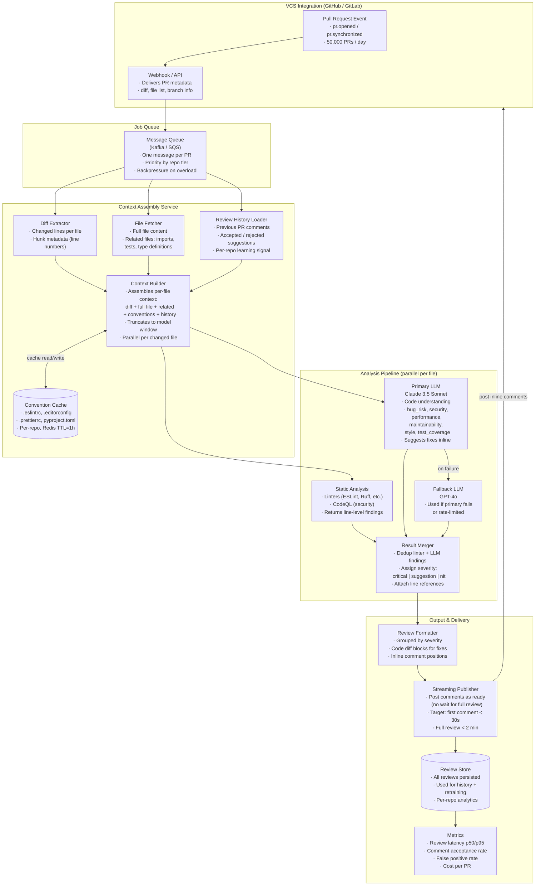

# Exercise 3: Code Review Assistant

### Problem Statement

Design a code review assistant for a development platform:

- Reviews pull requests automatically
- Provides specific, actionable feedback
- Respects repository style guides and conventions
- Can suggest code fixes
- Integration with GitHub/GitLab
- Handles 50,000 PRs per day

### Solution Highlights

**Key Technical Choices:**



1. **Context Assembly:**
```
For each changed file, assemble context:
- The diff (changed lines)
- Full file content (for understanding)
- Related files (imports, tests, types)
- Repository conventions (.eslintrc, .editorconfig)
- Previous review comments (learn from feedback)
```

2. **Review Categories:**
```python
review_types = [
    "bug_risk",           # Potential bugs
    "security",           # Security issues
    "performance",        # Performance concerns
    "maintainability",    # Code quality
    "style",              # Style guide violations
    "test_coverage"       # Missing tests
]
```

3. **Model Selection:**
```
Primary: Claude 3.5 Sonnet (best for code understanding)
Fallback: GPT-4o

Specialized models:
- Security scanning: CodeQL + LLM review
- Style: Linters + LLM explanation
```

4. **Output Format:**
```markdown
## Review Summary

### Critical Issues (must fix)
- **Line 45**: SQL injection vulnerability in user query
  ```python
  # Instead of:
  query = f"SELECT * FROM users WHERE id = {user_id}"
  # Use:
  query = "SELECT * FROM users WHERE id = ?"
  cursor.execute(query, (user_id,))
  ```

### Suggestions (consider fixing)
- **Line 78-82**: This loop could be simplified using list comprehension
...
```

5. **Latency Strategy:**
```
Target: Review ready within 2 minutes of PR creation

Strategy:
- Queue PR for processing
- Parallel processing of files
- Stream results as available
- Cache repository conventions
```

---
