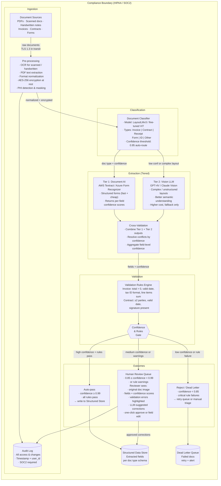

# Exercise 4: Document Processing Pipeline

### Problem Statement

Design a document processing pipeline for financial services:

- Process 100,000 documents per day (invoices, contracts, forms)
- Extract structured data with 99% accuracy
- Handle PDFs, scanned documents, handwritten notes
- HIPAA/SOC2 compliance
- Human review for low-confidence extractions

### Solution Highlights

**Pipeline Architecture:**



**Key Components:**

1. **Document Classification:**
```
Fine-tuned classifier on document types:
- Invoice, Contract, Receipt, Form, ID, Other

Model: LayoutLMv3 or fine-tuned ViT
Confidence threshold: 0.95 for auto-routing
```

2. **Extraction Strategy:**
```
Tiered extraction based on document type:

Tier 1: Document AI (Textract/Azure)
- Good for structured forms
- Fast and cheap
- Returns confidence scores

Tier 2: Vision LLM (GPT-4V/Claude)
- Fallback for complex layouts
- Better for unstructured text
- More expensive

Combine outputs and cross-validate.
```

3. **Validation Rules:**
```python
validation_rules = {
    "invoice": [
        ("total", lambda x: x > 0, "Total must be positive"),
        ("date", lambda x: parse_date(x), "Invalid date format"),
        ("vendor_id", lambda x: regex_match(x, TAX_ID_PATTERN), "Invalid tax ID"),
        ("line_items", lambda x: sum(i.amount for i in x) == total, "Line items must sum to total")
    ],
    "contract": [
        ("parties", lambda x: len(x) >= 2, "Contract must have at least 2 parties"),
        ("effective_date", lambda x: parse_date(x), "Invalid date"),
        ("signature_present", lambda x: x == True, "Signature required")
    ]
}
```

4. **Human Review Interface:**
```
Reviewer sees:
- Original document image
- Extracted fields with confidence scores
- Validation errors highlighted
- Suggested corrections from LLM
- One-click approval or field-level corrections
```

5. **Compliance Measures:**
```
HIPAA/SOC2 requirements:
- All documents encrypted at rest (AES-256)
- TLS 1.3 in transit
- Audit log for all access and changes
- PHI detection and masking
- Retention policies enforced
- Access controls with MFA
```

---
