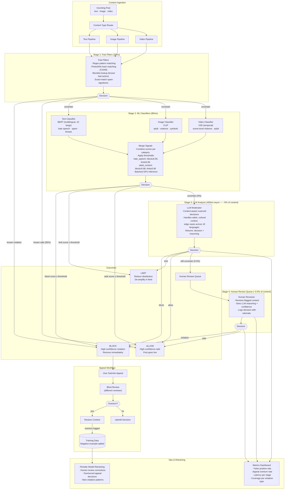

# Exercise 5: Real-Time Content Moderation

### Problem Statement

Design a content moderation system for a social platform:

- 1 million posts per day (text, images, video)
- Latency requirement: under 500ms for posts to be visible
- Detect: hate speech, violence, adult content, spam
- Appeal workflow for false positives
- Support 10 languages

### Solution Highlights

**Architecture Pattern: Multi-Stage Cascade**



**Key Design Decisions:**

1. **Latency Optimization:**
```
Target: 500ms total

Stage 1 (Fast): 20ms
- Regex patterns
- Known hash matching (PhotoDNA)
- Blocklist lookup

Stage 2 (ML): 80ms
- Batched inference on GPU
- Small specialized models
- Parallel text/image processing

Stage 3 (LLM): 400ms (async for borderline)
- Only 5% of content reaches here
- Used for nuanced decisions
```

2. **Threshold Strategy:**
```python
class ModerationDecision:
    BLOCK = "block"          # High confidence violation
    ALLOW = "allow"          # High confidence safe
    LIMIT = "limit"          # Reduce distribution
    REVIEW = "human_review"  # Queue for human

thresholds = {
    "hate_speech": {
        "block": 0.95,
        "limit": 0.80,
        "review": 0.60
    },
    "adult_content": {
        "block": 0.98,  # Higher threshold, legal implications
        "limit": 0.90,
        "review": 0.70
    }
}
```

3. **Appeal Workflow:**
```
1. User submits appeal
2. Content queued for human review
3. Different reviewer than original (blind review)
4. Decision logged with reasoning
5. If overturned:
   - Content restored
   - Original decision added to training data as negative
   - Model retrained periodically
```

---
