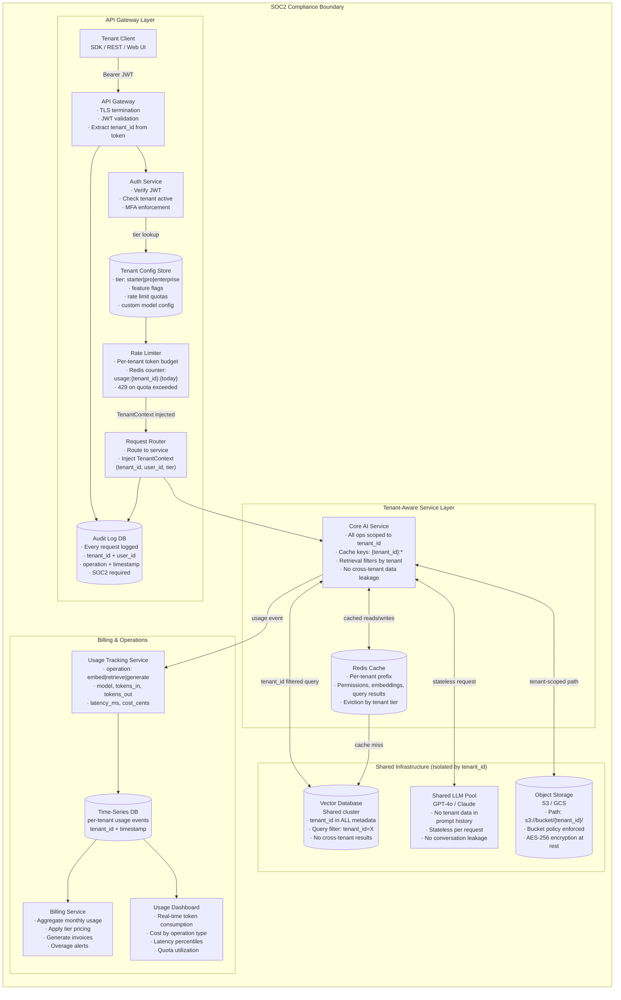

# Exercise 6: Multi-Tenant AI Platform

### Problem Statement

Design a multi-tenant AI platform (AI-as-a-Service):

- Serve 500+ enterprise customers
- Each customer has their own documents and models
- Complete data isolation between tenants
- Per-tenant usage tracking and billing
- Different pricing tiers with different capabilities
- SOC2 compliance required

### Solution Highlights

**Tenant Isolation Architecture:**



**Critical Isolation Points:**

```python
class TenantContext:
    tenant_id: str
    user_id: str
    tier: str  # "starter" | "pro" | "enterprise"
    
    def __enter__(self):
        # Set tenant context for all downstream calls
        _tenant_context.set(self)
        
    def __exit__(self, *args):
        _tenant_context.set(None)

# Middleware ensures tenant context on every request
@middleware
def enforce_tenant_context(request, call_next):
    tenant_id = extract_tenant_from_token(request.headers["Authorization"])
    with TenantContext(tenant_id=tenant_id, ...):
        verify_tenant_access(tenant_id, request.path)
        response = call_next(request)
        add_tenant_to_audit_log(tenant_id, request, response)
    return response
```

**Billing and Usage Tracking:**

```python
usage_schema = {
    "tenant_id": "string",
    "timestamp": "datetime",
    "operation": "embed|retrieve|generate",
    "model": "string",
    "tokens_in": "int",
    "tokens_out": "int",
    "latency_ms": "int",
    "cost_cents": "decimal"
}

# Real-time usage aggregation
async def track_usage(tenant_id: str, operation: Usage):
    # Append to time-series DB
    await timeseries.write("usage", {
        "tenant_id": tenant_id,
        **operation.dict()
    })
    
    # Update real-time counter for rate limiting
    await redis.incr(f"usage:{tenant_id}:{today()}", operation.tokens)
```

---
