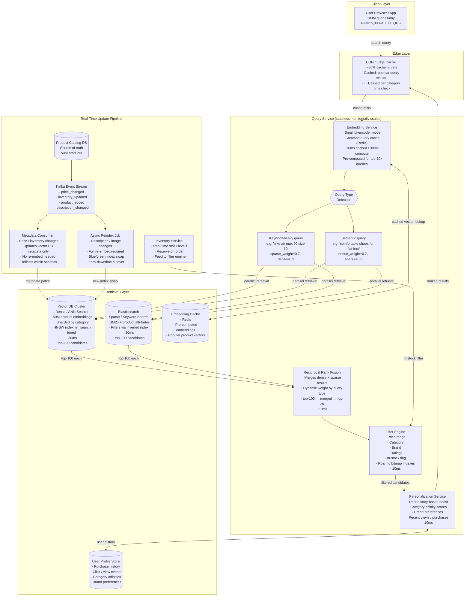

# Exercise 7: Semantic Search at Scale

### Problem Statement

Design a semantic search system for an e-commerce site:

- 50 million products
- 100 million queries per day
- P99 latency under 100ms
- Support filters (price, category, brand, ratings)
- Personalization based on user history
- Real-time inventory updates

### Solution Highlights

**Key Challenge: 100ms at 100M queries/day**

```
100M queries/day = 1,157 QPS average
Peak: 5,000-10,000 QPS

At 100ms latency, need:
- Edge caching
- Pre-computed embeddings
- Optimized retrieval
- Minimal LLM involvement
```

**Architecture:**



**Latency Budget:**

```
Edge cache check:    5ms
Embedding lookup:   10ms (cached) or 30ms (compute)
Vector search:      30ms
Filtering:          10ms
Personalization:    10ms
Serialization:      10ms
Network overhead:   25ms
─────────────────────
Total:              100ms target (with cache hit)
```

**Hybrid Search Strategy:**

```python
def search(query: str, filters: dict, user_id: str) -> List[Product]:
    # Determine search strategy based on query
    if is_keyword_heavy(query):
        # "nike air max 90 size 10"
        sparse_weight = 0.7
        dense_weight = 0.3
    else:
        # "comfortable running shoes for flat feet"
        sparse_weight = 0.3
        dense_weight = 0.7
    
    # Parallel retrieval
    dense_results = vector_db.search(embed(query), top_k=100, filter=filters)
    sparse_results = elastic.search(query, top_k=100, filter=filters)
    
    # Reciprocal rank fusion
    combined = rrf_merge(
        [dense_results, sparse_results],
        weights=[dense_weight, sparse_weight]
    )
    
    # Personalization boost
    personalized = apply_user_preferences(combined, user_id)
    
    return personalized[:20]
```

**Real-Time Updates:**

```
Product updates (price, inventory) flow:
1. Change event published to Kafka
2. Consumer updates vector DB metadata
3. Search reflects change within seconds

Reindexing (description changes):
1. Full re-embed required
2. Run as async job
3. Swap index when complete
```

---
